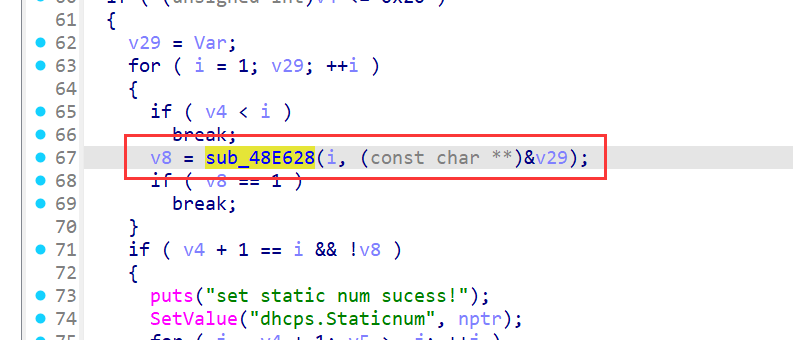
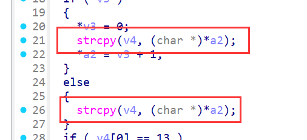

# Stack-Based Buffer Overflow in Tenda AC20 (firmware V16.03.08.12) fromSetIpMacBind

## Summary

A stack-based buffer overflow vulnerability in the Tenda AC20 router (firmware V16.03.08.12) allows unauthenticated remote attackers to execute arbitrary code or cause denial of service (DoS) via the `list` parameter in the `/goform/SetIpMacBind` endpoint. The flaw resides in the `sub_48E628` function, which processes the `list` input using the unsafe `strcpy` function without bounds checking, leading to stack memory corruption.

## Details


*   **Vendor**: Tenda

*   **Product**: Tenda AC20

*   **Firmware Version**: V16.03.08.12

*   **Firmware Download**: [https://www.tenda.com.cn/material/show/3264](https://www.tenda.com.cn/material/show/3264)

*   **Component**: `/goform/SetIpMacBind`

*   **Vulnerability Type**: Stack-Based Buffer Overflow (CWE-121)

*   **CVE ID**: Pending

*   **Reported by**: n0ps1ed (n0ps1edzz@gmail.com)

## Description

The vulnerability exists in the processing chain of the `list` parameter in the `fromSetIpMacBind` function and its dependent `sub_48E628` function. The call chain and key operations are as follows:


1.  **Parameter Retrieval**: The `list` parameter is retrieved via `websGetVar` in `fromSetIpMacBind` and passed to `sub_48E628` for IP-MAC binding rule processing. The `bindnum` parameter specifies the number of binding rules to process.

2.  **Rule Parsing**: `sub_48E628` is called iteratively to process each rule in `list`. It splits the input by the delimiter (ASCII 10, line feed) using `strchr`, treating each segment as an individual IP-MAC binding rule.

3.  **Unsafe Copy**: For each split rule segment, the critical unsafe operation occurs:

*   `strcpy(v4, (char *)*a2)`: Copies the user-controlled rule segment (`*a2`, derived from `list`) into `v4`, a fixed-size 128-byte stack buffer.

*   `strcpy` does not validate the length of the input against the size of `v4`. If the rule segment exceeds 127 bytes (plus the null terminator), it will overflow the `v4` buffer.

1.  **Subsequent Parsing**: After the unsafe copy, `sscanf` is used to parse fields from `v4` (e.g., device name, MAC address, IP address). However, the prior `strcpy` already introduces the overflow risk, as the buffer may have already been corrupted before parsing.

If the user-controlled `list` parameter contains a rule segment longer than 127 bytes, `strcpy(v4, (char *)*a2)` will overflow the 128-byte `v4` buffer, overwriting adjacent stack memory (including return addresses, saved registers, and other critical stack data). This allows an attacker to corrupt the stack and potentially execute arbitrary code.


## PoC: Python Exploit Script


```
from pwn import *
import requests
url = "http://192.168.xxx.xxx/goform/SetIpMacBind"
cookie = {"Cookie":"password=rfl1qw"}
data = {"bindnum": "1","list": cyclic(1000)}
res = requests.post(url, cookies=cookie, data=data)
res = requests.post(url, cookies=cookie, data=data)
print(res.text)
```


This script sends a crafted `list` parameter containing an overly long IP-MAC binding rule segment. When processed by `sub_48E628`, the `strcpy(v4, (char *)*a2)` call will overflow the `v4` buffer, causing stack corruption. Successful exploitation may result in arbitrary code execution or a denial of service condition (router crash/reboot).
