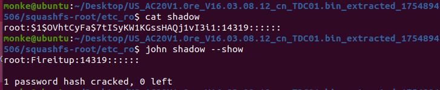

# Tenda AC20 root Hardcoded Credentials Vulnerability

## Summary

A hardcoded credentials vulnerability exists in the Tenda AC20 router (firmware V16.03.08.12). The root user account in the device uses a hardcoded password, which is stored in the `/etc_ro/shadow` file with an MD5-crypt hash. This allows attackers to obtain the root password through password-cracking tools, thereby gaining unauthorized access to the router's system.

## Details

*   **Vendor**: Tenda

*   **Product**: Tenda AC20

*   **Firmware Version**: V16.03.08.12

*   **Firmware Download**: https://www.tenda.com.cn/material/show/3264
*   **Component**: `/etc_ro/shadow` file (root user authentication)

*   **Vulnerability Type**: Use of Hardcoded Credentials (CWE-798)

*   **CVE ID**: CVE-2025-9091

*   **Reported by**: n0ps1ed (n0ps1edzz@gmail.com)

## Description

The vulnerability is caused by the hardcoding of the root user's password in the Tenda AC20 router firmware. During the analysis of the firmware, it was found that the `/etc_ro/shadow` file, which stores user account information, contains the root user's password hash. This hash can be easily cracked using password-cracking tools, revealing the plaintext password, thus enabling attackers to log in to the router's system with root privileges.

Key findings in the firmware analysis are as follows:

1.  **Firmware Extraction**: After extracting the firmware file `US_AC20V1.0re_V16.03.08.12_cn_TDC01.bin`, the system file structure was obtained, including the `/etc_ro/` directory.

2.  **Shadow File Analysis**: The `shadow` file in the `/etc_ro/` directory was examined, and the root user's password hash entry was found.

3.  **Password Cracking**: Using the John the Ripper tool to crack the above hash, the plaintext password "Fireitup" for the root user was successfully obtained:

