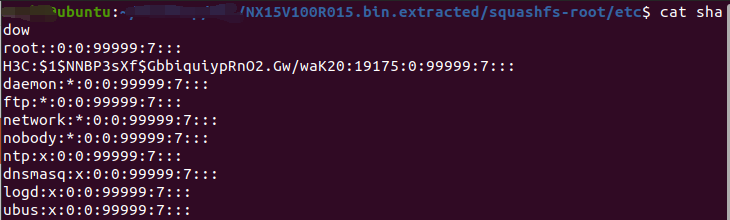

# Insecure Default Password in H3C Device (NX15V100R015)
## Overview
An insecure default password vulnerability was identified in the H3C device running firmware version NX15V100R015. The root user account has no password set, and the H3C user account uses a default password, both stored in the `/etc/shadow` file. The root account's lack of a password and the H3C user's weak password, revealed as "admin" via John the Ripper, can be exploited to gain unauthorized root access to the device through network-accessible services or the administrative interface.

## Vulnerability Details
- **Vulnerability Type**: Insecure Default Credentials
- **Affected Product**: H3C Device
- **Affected Version**: NX15V100R015
- **Attack Type**: Remote
- **Attack Vector**: Unauthorized login using default credentials (root with no password or H3C:admin) via network-accessible services or administrative interface
- **Impact**:
  - Escalation of Privileges
  - Information Disclosure
  - Potential Code Execution
- **Affected Component**: `/etc/shadow` file, user authentication mechanism
- **CVE ID**: Pending (CVE application in progress)
- **Discovered by**: n0ps1ed (n0ps1edzz@gmail.com)
- **Firmware**: https://www.h3c.com/cn/d_202504/2407151_30005_0.htm

## Discovery
The vulnerability was discovered by analyzing the firmware (_NX15V100R015.bin). The `/etc/shadow` file was extracted from the squashfs-root directory, revealing that the root user has no password set (`NO PASSWORD`) and the H3C user's MD5-crypt hash was cracked using John the Ripper, yielding the password "admin." These weak credentials allow attackers to log in to the device’s administrative interface or other services without additional exploits.

## Steps to Reproduce
1. Extract the firmware image `_NX15V100R015.bin`.
2. Locate the `/etc/shadow` file in the extracted squashfs-root directory (`squashfs-root/etc/shadow`).
3. Observe the root user entry with `NO PASSWORD` or use a password-cracking tool (e.g., John the Ripper) to crack the H3C user’s MD5-crypt hash:

4. Attempt to log in to the device’s administrative interface or other network-accessible services using the credentials `root` (no password) or `H3C:admin`.

## Impact
An attacker with network access to the device can:
- Gain full administrative control by logging in with the root account (no password) or the H3C account (password: "admin").
- Access sensitive configuration data, potentially exposing network details.
- Modify device settings or execute arbitrary code, leading to further network compromise.
