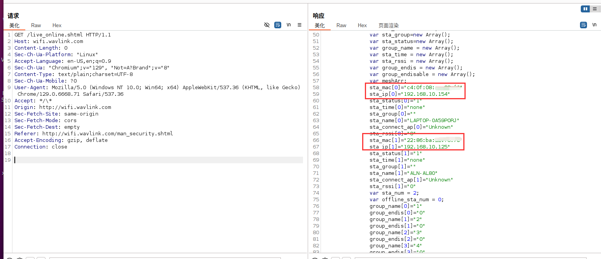

# WAVLINK Device Unauthenticated Sensitive Information Disclosure (/live\_online.shtml)

## Overview

An **unauthenticated sensitive information disclosure vulnerability** exists in WAVLINK devices (e.g., WL-WN578W2) when accessing `/live_online.shtml`. The endpoint **lists all connected WiFi devices** and leaks their **MAC addresses** and **IP addresses** without any authentication, enabling attackers to fully map the network for further targeted attacks.

## Details

*   **Vendor**: WAVLINK

*   **Vendor Website**: [https://www.wavlink.com/zh\_cn/index.html](https://www.wavlink.com/zh_cn/index.html)

*   **Product**: WAVLINK WL-WN578W2 (wireless range extender)

*   **Firmware**: M78W2\_V221110

*   **Firmware Download**: https://docs.wavlink.xyz/Firmware_ch/fm-578w2/

*   **Affected Endpoint**: `/live_online.shtml` (GET method, no authentication required)

*   **Leaked Information**: **Complete list of all devices connected to the WiFi** including their MAC addresses (`sta_mac`), IP addresses (`sta_ip`), and device names (`sta_name`).

*   **Vulnerability Type**: Unauthenticated Sensitive Information Disclosure

*   **Impact**: Exposes full network device inventory with identities/addresses

## Proof

visit /live_online.shtml

